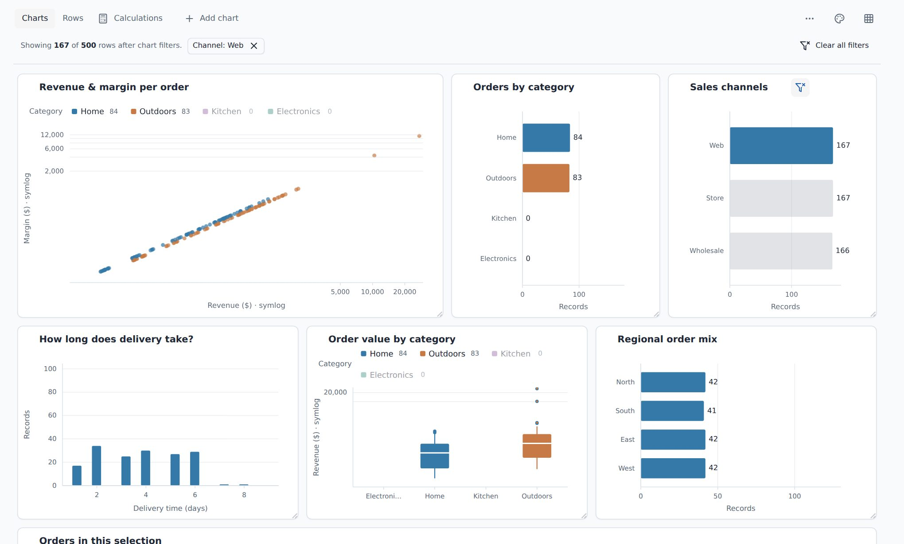

# explorEDA

**Embed an interactive analysis workspace in your React app.**

Give users linked charts, record-level tables, and editable calculated fields
without building the workspace around them.

[Live demo](https://byronwall.github.io/explorEDA/) ·
[Package docs](packages/explorEDA/README.md) ·
[Example source](apps/demo/src/demos)



## Why a workspace

Linked filtering alone is common. explorEDA also provides the parts around the
charts: configuration, record inspection, formulas, and restorable settings.

- **Linked views and their records.** A selection in one chart filters every
  other view and the record table, so users can check the rows behind a
  pattern.
- **Calculated fields users can inspect.** Formulas show their dependency
  chains, and the editor previews a draft before it is applied across views.
- **Settings your app keeps.** Users arrange the analysis visually. Your app
  receives the settings as JSON and restores them later through `savedData`.

Chart types include row, bar, line, scatter, 3D scatter, box plot, pivot
table, data table, summary table, markdown, and color legend.

## Install

```sh
pnpm add exploreda
```

React and ReactDOM 18 or 19 are peer dependencies.

## Use it in your React app

```tsx
import { ExplorEda, type SavedDataStructure } from "exploreda";
import "exploreda/dist/ExplorEda.css";

type Order = Record<string, string | number | boolean | null>;

export function OrdersExplorer({
  orders,
  savedSettings,
  onSettingsChange,
}: {
  orders: Order[];
  savedSettings?: SavedDataStructure;
  onSettingsChange: (settings: SavedDataStructure) => void;
}) {
  return (
    <ExplorEda
      data={orders}
      savedData={savedSettings}
      onStateChange={onSettingsChange}
    />
  );
}
```

Three props define the boundary between your app and the workspace:

| Prop            | Role     | What it does                                                                                                 |
| --------------- | -------- | ------------------------------------------------------------------------------------------------------------ |
| `data`          | Input    | The rows your app supplies. Pass a new array when the rows change; in-place mutations are not observed.      |
| `savedData`     | Restore  | Optional settings that restore charts, calculations, Rows filters, and layout. Read on mount or replacement. |
| `onStateChange` | Callback | Called after meaningful edits with JSON settings, never raw rows. Your app decides where to keep them.       |

`savedData` is not a controlled value, so do not feed each `onStateChange`
result back into it. The [package docs](packages/explorEDA/README.md) cover
the settings shape, full analysis bundles with rows, and registering only the
charts you need.

## Before you integrate

- **Screen size:** desktop viewports of 1024 CSS pixels or more.
- **Browser:** DOM and Canvas 2D. The 3D scatter chart also needs WebGL.
- **Storage:** none built in. Settings and full analysis exports are JSON your
  app stores.

## Develop

This repository is a pnpm workspace: the library is in `packages/explorEDA`
and the demo site is in `apps/demo`. It requires pnpm 11.9.0.

```sh
pnpm install
pnpm check              # UI rules, build, typecheck, and tests
pnpm --filter demo dev  # demo site at http://localhost:5173/explorEDA/
```

## Inspiration

explorEDA was inspired by [DC.js](https://dc-js.github.io/dc.js/) and
[Crossfilter](https://github.com/crossfilter/crossfilter).
