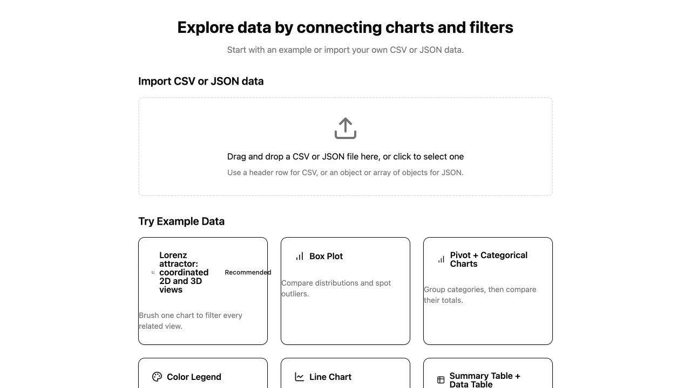
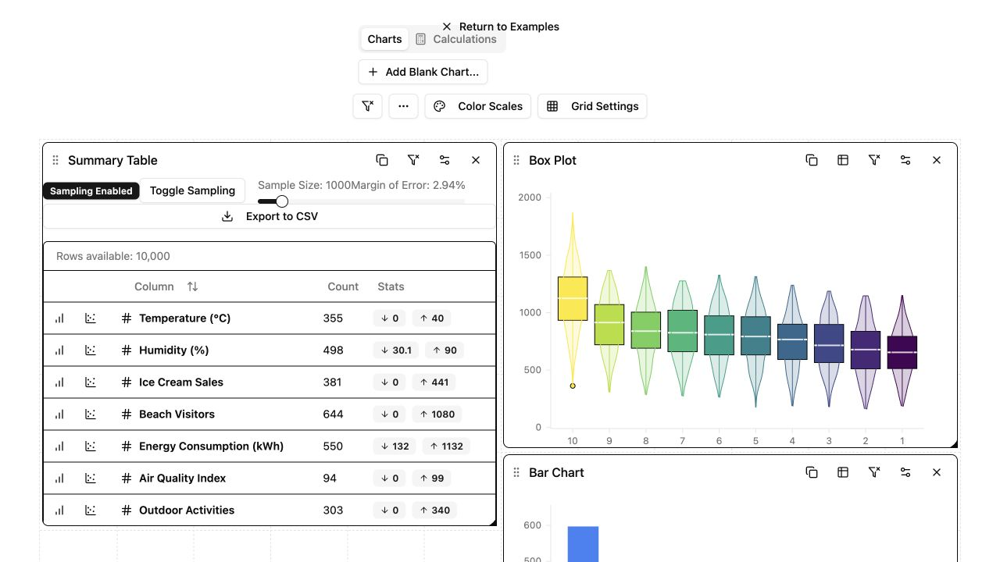
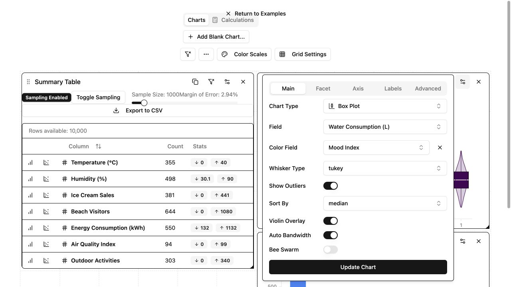
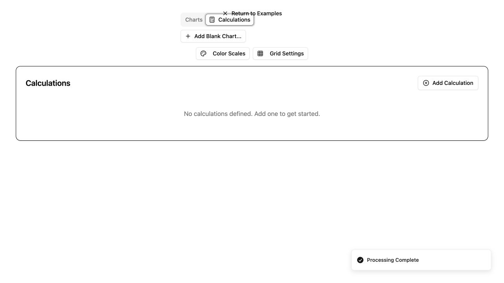

# explorEDA UI and UX audit

Date: 2026-09-14

## Executive assessment

explorEDA has a strong product concept. It lets users connect charts, filters, tables, and calculations in one workspace.

At audit time, the interface did not yet support that concept. The main problems were structural, not decorative. Controls overlapped. Important actions failed. Spacing changed by accident instead of following a system.

The recommended direction is a calm data workbench. Use one compact toolbar, quiet surfaces, clear chart frames, and a small token set. Do not add a large design system or new UI dependency.

## Implementation status (2026-09-15)

The findings below are the original audit findings. This audit remains the evidence record.
Desktop support is >=1024 CSS px. Mobile and narrow layouts remain out of scope.

| Original finding                                   | Status   | Relevant commit                 | Current verification                                                    |
| -------------------------------------------------- | -------- | ------------------------------- | ----------------------------------------------------------------------- |
| Return action blocks Calculations                  | Resolved | `f7bc87e`, `e2232ad`            | Normal-flow header; 1024 and 1280 desktop captures.                     |
| Calculation helper actions submit the form         | Resolved | `f7bc87e`                       | Current source sets explicit types for helper actions.                  |
| Summary chart actions have no accessible name      | Resolved | `f7bc87e`                       | Labels include the action, chart type, and column.                      |
| Landing card content has no horizontal padding     | Resolved | `3ef1b25`                       | Cards use `px-5` and separate badge flow.                               |
| Workspace overlaps while layout settles            | Resolved | `cd67997`                       | Grid waits for measured width; settled Box Plot captures pass.          |
| Borders use text color instead of the border token | Resolved | `3ef1b25`, `14d850b`, `4a17da4` | Global `border-border` and quieter variants are present.                |
| Motion has no reduced-motion treatment             | Resolved | `e2232ad`, `3f72048`            | Landing, spinner, and shared overlay animations honor reduced motion.   |
| Workspace heading hierarchy starts at level three  | Resolved | `e2232ad`                       | Workspace `h1` and chart-area `h2` are present.                         |
| Navigation does not reset scroll position          | Resolved | `f7bc87e`                       | Focus and `scrollIntoView` run after data loads.                        |
| Shell spends too much space before the work area   | Resolved | `e2232ad`, `1949bb2`            | 1024 and 1280 landing and workspace checks show tighter vertical space. |

### Final post-change desktop sweep (2026-09-15)

The final sweep covers all nine examples at 1280 CSS pixels. Selected boundary cases also cover 1024 CSS pixels.

| Example              | Result | Relevant commit(s)                         | Sweep evidence                                                                   |
| -------------------- | ------ | ------------------------------------------ | -------------------------------------------------------------------------------- |
| Lorenz               | Pass   | `5ef70de`, `4a17da4`                       | Six 3D canvases render, survive a 2D brush, and sync cameras. Console clean.     |
| Box Plot             | Pass   | `4a17da4`                                  | Console clean; no settled panel overlap or header collision.                     |
| Pivot + Categorical  | Pass   | `45e1831`, `93ccde3`, `ffb6b33`            | Row labels and ticks fit. Bar geometry stays above ticks at 1280.                |
| Color Legend         | Pass   | `45e1831`, `4a17da4`                       | Passes at 1280 and 1024.                                                         |
| Line Chart           | Pass   | `8601d72`, `45e1831`, `93ccde3`            | Axes pass at 1280 and 1024.                                                      |
| Summary + Data Table | Pass   | `1949bb2`, `4a17da4`                       | Summary Table polish; console clean and no settled panel overlap.                |
| FIFA                 | Pass   | `8601d72`, `45e1831`, `ffb6b33`            | Row labels pass after the row fixes. Prior slow settle is not a current failure. |
| World Bank           | Pass   | `45e1831`, `93ccde3`, `568b6d1`, `1bc4713` | All 16 facets show readable axes and a nonblank title.                           |
| NBA                  | Pass   | `45e1831`, `4a17da4`                       | Passes at 1280 and 1024; scatter axes and points align.                          |

All relevant console checks were clean. No settled panel overlap or header collision appeared.

### Resolved post-audit sweep items

| Item               | Status   | Commit    | Verification                                                                          |
| ------------------ | -------- | --------- | ------------------------------------------------------------------------------------- |
| Blank panel titles | Resolved | `1bc4713` | Line Chart and World Bank show fallback titles with matching accessible action names. |
| 3D lifecycle       | Resolved | `5ef70de` | All six 3D canvases render automatically, survive a 2D brush, and sync cameras.       |

### Intended audience and purpose

- **Inferred audience:** A technical user who wants fast exploratory analysis without writing chart code.
- **Primary outcome:** Load data, create or inspect charts, filter related views, and save useful findings.
- **Mode:** Operate. Task clarity and scan speed are more important than marketing expression.
- **Supported display:** Desktop viewports at 1024 CSS pixels or more.
- **Out of scope:** Narrow and mobile layouts. Defects below 1024 pixels are not release blockers.

### Highest-priority problems

These are the baseline problems recorded during the audit. See the implementation status table for current state.

1. The absolute return control overlaps the workspace tabs. Pointer clicks on **Calculations** open the landing page.
2. Calculation helper buttons submit the form. **Validate** creates a calculation instead of only validating it.
3. The landing cards omit horizontal content padding. Text touches borders and collides with the badge.
4. Chart panels visibly overlap while the desktop workspace settles.
5. Strong black borders dominate the interface despite an existing border token.

### Strong qualities to preserve

- The landing page states the main product action in one sentence.
- Example descriptions explain the value of each dataset.
- Chart panels expose useful screen-reader summaries.
- Most chart toolbar buttons have clear accessible names.
- The calculation dialog uses a real modal, labels, headings, and an explicit close control.

## Scope and method

The audit used the local Vite demo at `/explorEDA/`.

### Browser coverage

- Desktop viewport: 1280 by 720 pixels.
- Inputs: pointer and keyboard.
- Browser console: No warnings or errors during the tested flows.
- Final post-change sweep: all nine examples checked at 1280 CSS pixels.
- Boundary checks: selected examples checked at 1024 CSS pixels.
- Sweep result: clean console output and no settled panel overlap in every example.
- Final result: no settled panel overlap or header collision in the checked flows.
- Build: `pnpm --filter demo build` passed.
- Narrow-width observations were removed after the product scope was clarified.

### Journeys

1. **Orient:** Identify the product purpose, import path, and example path.
2. **Explore:** Load the Lorenz and Box Plot examples and inspect the chart workspace.
3. **Configure:** Open chart settings and inspect its desktop layout.
4. **Calculate:** Open Calculations, add a calculation, insert a field, and validate an expression.

### Coverage limits

- The audit sampled 2 of 9 examples.
- It sampled scatter, 3D scatter, box plot, bar chart, summary table, and calculation surfaces.
- It did not upload a private file.
- It did not assess data correctness or chart mathematics.
- It did not run user research. Comprehension scores are expert judgments.

## UX scorecard

This is the baseline scorecard from the audit session. Use the implementation status table above for current repair status; do not read these scores as a fresh post-change measurement.

| Category                            | Score | Coverage | Evidence-based rationale                                              |
| ----------------------------------- | ----: | -------- | --------------------------------------------------------------------- |
| Orientation and purpose             |   4/5 | High     | The first heading and two start paths are clear.                      |
| Information architecture            |   2/5 | Medium   | Workspace controls have weak grouping and no stable page header.      |
| Content hierarchy and learning flow |   2/5 | Medium   | Examples help, but the workspace starts with controls before context. |
| Diagram communication               |   3/5 | Medium   | Sampled desktop charts are readable after the initial layout settles. |
| Interactive examples                |   1/5 | High     | Key example, settings, and calculation actions fail or misfire.       |
| Navigation and wayfinding           |   1/5 | High     | The return action overlaps tabs and scroll position is not reset.     |
| Visual hierarchy and readability    |   1/5 | High     | Borders dominate. Padding, density, and alignment vary by surface.    |
| Interaction quality                 |   1/5 | High     | Wrong targets receive clicks. Loading causes visible chart overlap.   |
| Accessibility                       |   1/5 | Medium   | Names exist in many places. Key icon actions have no names.           |
| Responsive experience               |   N/A | N/A      | Narrow and mobile layouts are outside the supported product scope.    |
| Trust and quality                   |   1/5 | High     | Functional click errors and unstable layout reduce confidence.        |

## Technical audit health score

This is the baseline technical score from the audit session. The current source has since repaired several findings listed below.

| #         | Dimension                |    Score | Key finding                                                                  |
| --------- | ------------------------ | -------: | ---------------------------------------------------------------------------- |
| 1         | Accessibility            |      1/4 | Unnamed icon actions and no reduced-motion path.                             |
| 2         | Performance              |      2/4 | Deferred loading helps, but the workspace visibly overlaps while it settles. |
| 3         | Responsive design        |      N/A | Narrow and mobile layouts are outside the supported product scope.           |
| 4         | Theming                  |      2/4 | Color tokens exist. Spacing, type, control, and border tokens do not.        |
| 5         | Implementation integrity |      1/4 | Overlap and implicit form submission break primary actions.                  |
| **Total** |                          | **6/16** | **Poor: major repair is required.**                                          |

## Implementation integrity verdict

This is the baseline verdict from the audit session. The implementation status and post-change sweep above record current evidence.

**Fail.** The interface has useful product-specific parts, but its shell does not form one coherent system.

The most important evidence is functional. A pointer click on **Calculations** activates **Return to Examples**. Helper buttons in the calculation form use the browser's default submit behavior.

The mechanical detector reported two warnings. The spinner warning is not material. The Markdown side border is a low-priority style issue. Neither warning explains the main quality problems.

## Journey results

These results preserve the original audit observations. They are not a post-change measurement.

### 1. Orient

- **Outcome:** Success with visual friction.
- **Success criteria:** Explain the product and find a starting action.
- **Observed:** The heading describes connected charts and filters. Import and examples are visible.
- **Friction:** The first screen uses too much vertical space. Example cards have broken padding and dense title rows.
- **Confidence:** High.

### 2. Explore an example

- **Outcome:** Partial success.
- **Success criteria:** Load an example and understand the workspace.
- **Observed:** Both tested examples loaded. Charts became readable after layout settled.
- **Friction:** Chart panels overlapped for about three seconds after direct load. The toolbar has no stable frame. The return action sits above it.
- **Recovery:** Waiting resolves the chart overlap. No user action explains this delay.
- **Confidence:** High.

### 3. Configure a chart

- **Outcome:** Success with density concerns.
- **Success criteria:** Open settings, review fields, and update the chart.
- **Observed:** The desktop popover opens and exposes five setting groups.
- **Confidence:** High.

### 4. Create a calculation

- **Outcome:** Failure with pointer, partial success with keyboard.
- **Success criteria:** Open Calculations, enter a name and expression, validate, then submit.
- **Observed:** A pointer click on the Calculations tab returned to the landing page.
- **Observed:** Keyboard activation opened the Calculations panel.
- **Observed:** Selecting an available field also submitted the form and produced an error toast.
- **Observed:** With valid values, clicking **Validate** created the calculation and closed the dialog.
- **Recovery:** Keyboard users can open the tab. There is no way to use validation without submission.
- **Confidence:** High.

## Prioritized findings

These findings preserve the original evidence and acceptance checks. Their current status is in the implementation status table.

### P1 — The return action blocks the Calculations tab

- **Surface:** Workspace header at 1280 by 720.
- **Reproduction:** Load an example. Click **Calculations** with a pointer.
- **Evidence:** The app returns to the examples page. Keyboard activation opens Calculations.
- **Cause:** The return button is absolutely centered at the top. Its box overlaps the tab strip.
- **Location:** `apps/demo/src/LandingPage.tsx:122` and `packages/explorEDA/src/components/PlotManager.tsx:149`.
- **User effect:** Pointer users cannot open a primary workspace area.
- **Recommendation:** Put navigation and workspace controls in one normal-flow header. Do not center an absolute control over the toolbar.
- **Acceptance check:** Pointer and keyboard activation both open Calculations in the supported desktop range.
- **Repeatability:** Repeatable.
- **Effort:** Small.

### P1 — Calculation helper actions submit the form

- **Surface:** Add New Calculation dialog.
- **Reproduction:** Select an available field. Then enter valid values and click **Validate**.
- **Evidence:** Field selection produced a submit error. Validate created `audit_calc` and closed the dialog.
- **Cause:** Field and Validate buttons omit `type="button"` inside a form.
- **Location:** `packages/explorEDA/src/components/calculations/CalculationForm.tsx:85` and `:111`.
- **User effect:** Users cannot validate safely. Field insertion shows unrelated errors.
- **Recommendation:** Add `type="button"` to all non-submit form actions.
- **Acceptance check:** Field buttons only insert text. Validate only updates the validation message. Only the final action submits.
- **Repeatability:** Repeatable.
- **Effort:** Small.

### P1 — Summary chart actions have no accessible name

- **Surface:** Summary Table action column.
- **Reproduction:** Load Box Plot. Inspect the screen-reader tree or move through action buttons.
- **Evidence:** The action cells expose repeated unnamed buttons.
- **Cause:** Icon-only buttons omit `aria-label` and `title`.
- **Location:** `packages/explorEDA/src/components/SummaryTable/components/ChartActions.tsx:16`.
- **User effect:** Screen-reader users cannot know which chart each button creates.
- **Standard:** WCAG 2.2, 4.1.2 Name, Role, Value.
- **Recommendation:** Name each action with its chart type and column. Example: `Create bar chart for Temperature`.
- **Acceptance check:** Every action has a unique accessible name in the browser tree.
- **Repeatability:** Repeatable.
- **Effort:** Small.

### P2 — Landing card content has no horizontal padding

- **Surface:** All nine example cards.
- **Reproduction:** Open the landing page at 1280 by 720.
- **Evidence:** Browser measurements show `padding: 24px 0px`. Descriptions touch the border. The recommended badge collides with the long title.
- **Cause:** The button copies the outer Card classes. It renders `CardDescription` outside a padded content container.
- **Location:** `apps/demo/src/ExampleSelector.tsx:17` and `:31`.
- **User effect:** The first product screen looks broken and is harder to scan.
- **Recommendation:** Use one padded card button. Use `p-4` or `p-5`, `gap-2`, and top-aligned title and badge rows.
- **Acceptance check:** All content keeps at least 16 pixels from card edges. Titles and badges never overlap.
- **Repeatability:** Repeatable.
- **Effort:** Small.

### P2 — The workspace visibly overlaps while layout settles

- **Surface:** Box Plot workspace after direct load.
- **Reproduction:** Open `?example=box-plot` and observe the first seconds.
- **Evidence:** Summary, Box Plot, and Bar Chart panels overlap before the measured layout stabilizes.
- **Cause:** Chart sizes render before the container width and derived layout are ready.
- **Location:** `packages/explorEDA/src/components/PlotManager.tsx:72` and `packages/explorEDA/src/components/ChartGridLayout.tsx:23`.
- **User effect:** Users see a broken dashboard during every initial load. This reduces trust.
- **Recommendation:** Do not render the grid until container width is positive. Show a quiet workspace skeleton until then.
- **Acceptance check:** No chart boxes overlap in any captured animation frame after navigation.
- **Repeatability:** Repeatable.
- **Effort:** Small.

### P2 — Borders use the text color instead of the border token

- **Surface:** Landing cards, chart panels, tables, and dialogs.
- **Evidence:** A fresh landing card computed to a black border. The root defines a light gray `--border` token.
- **Cause:** Many components use bare `border`. The shared base layer does not apply `border-border` to elements.
- **Location:** `packages/explorEDA/src/index.css:7`, `apps/demo/src/ExampleSelector.tsx:17`, and `packages/explorEDA/src/components/PlotChartPanel.tsx:87`.
- **User effect:** Borders become the strongest visual element. The interface feels dense and unfinished.
- **Recommendation:** Apply the border token in the shared base layer. Keep strong borders only for selected or editable states.
- **Acceptance check:** Default dividers use the subtle border token. Focus and selected states remain stronger.
- **Repeatability:** Repeatable.
- **Effort:** Small.

### P2 — Motion has no reduced-motion treatment

- **Surface:** Landing transitions, loaders, menus, dialogs, tooltips.
- **Evidence:** Framer Motion and several CSS animations run without a `prefers-reduced-motion` alternative.
- **Location:** `apps/demo/src/LandingPage.tsx:133` and shared UI animation classes.
- **User effect:** Motion-sensitive users cannot reduce nonessential movement.
- **Standard:** WCAG 2.2, 2.3.3 Animation from Interactions.
- **Recommendation:** Disable translation and scale under reduced motion. Keep instant opacity or state changes.
- **Acceptance check:** Reduced-motion mode removes movement without hiding state changes.
- **Repeatability:** Repeatable.
- **Effort:** Small.

### P2 — Workspace heading hierarchy starts at level three

- **Surface:** Chart workspace.
- **Evidence:** The page exposes only `h3` chart titles. It has no workspace `h1` or `h2`.
- **Location:** `packages/explorEDA/src/components/PlotChartPanel.tsx:99`.
- **User effect:** Screen-reader users receive weak page structure and no clear workspace title.
- **Recommendation:** Add one visually modest `h1` for the workspace or loaded dataset. Keep chart titles at `h2` or `h3` under it.
- **Acceptance check:** The heading outline starts at level one and does not skip levels.
- **Repeatability:** Repeatable.
- **Effort:** Small.

### P2 — Navigation does not reset scroll position

- **Surface:** Landing-to-workspace transition.
- **Reproduction:** Scroll the landing page. Select an example.
- **Evidence:** The workspace retained a 180-pixel scroll offset.
- **User effect:** Users can enter the workspace below its main controls and lose orientation.
- **Recommendation:** Move focus to the workspace heading and scroll it into view after successful load.
- **Acceptance check:** Example selection starts at the workspace heading. Back returns to the selected landing card.
- **Repeatability:** Repeatable.
- **Effort:** Small.

### P3 — The shell spends too much space before the work area

- **Surface:** Landing and workspace.
- **Evidence:** The landing upload target is 180 pixels tall. The workspace toolbar occupies several centered rows.
- **User effect:** Users see fewer examples and less chart content in the first viewport.
- **Recommendation:** Reduce the upload area to 120–140 pixels. Use one left-aligned workspace header with grouped actions.
- **Acceptance check:** A 1280-pixel desktop shows the complete first row of examples.
- **Effort:** Small.

## Proposed visual direction

Use a neutral workbench with one restrained blue accent. The charts should provide most of the color.

### Layout rules

- Use normal document flow for all page and workspace headers.
- Use a 960-pixel landing container.
- Let the workspace use the available width up to 1440 pixels.
- Use one toolbar row in the supported desktop range.
- Use 16-pixel panel gaps. Do not simulate gaps with borders and manual width subtraction.
- Keep chart panel headers 40 pixels high.
- Use side panels or dialogs for settings when a popover becomes too dense.

### Recommended tokens

Do not add a second `--ui-*`, spacing, or type token system. The applied token system is the existing semantic CSS variables in `packages/explorEDA/src/index.css`, mapped to Tailwind utilities through `@theme`. Use those variables for color, border, radius, and focus semantics. Use Tailwind spacing and type utilities such as `gap-6`, `p-6`, `text-sm`, and `text-xl` for layout and text scale.

| Surface                           | Applied system                                                                       |
| --------------------------------- | ------------------------------------------------------------------------------------ |
| Page, cards, panels, and controls | Semantic color variables such as `--background`, `--card`, `--border`, and `--ring`. |
| Spacing and type                  | Tailwind spacing, size, weight, and leading utilities.                               |
| Borders and radius                | Global `border-border` plus the existing `--border` and `--radius` mappings.         |

No additional token is required by the current source. Extend the existing semantic variables only if a later repeated value needs central control.

### Typography rules

- Use the existing system sans stack.
- Use 14 pixels for compact controls and tables.
- Use 16 pixels for body and form input text.
- Use 20 pixels for section titles.
- Use 28 pixels for the landing title.
- Use sentence case for all actions and headings.
- Limit landing copy to about 60 characters per line.

## Recommended next steps

No active audit findings remain in the supported desktop scope.

1. Keep broader integration flow tests deferred until behavior stabilizes. Current verification is lean browser checks plus `pnpm --filter demo build` and `pnpm --filter demo check-types`.
2. Run a fresh audit later to rescore the desktop experience.

## Deferred review commands

1. **`/impeccable audit`:** Re-measure the desktop experience during a future fresh audit.

## Evidence index

| Evidence                                | What it shows                                                  |
| --------------------------------------- | -------------------------------------------------------------- |
| `landing-desktop.jpg`                   | Missing card padding, badge collision, and high vertical cost. |
| `workspace-lorenz-desktop.jpg`          | Overlapping header controls and dense chart frames.            |
| `workspace-boxplot-top-desktop.jpg`     | Chart overlap during initial layout.                           |
| `workspace-boxplot-settled-desktop.jpg` | Settled two-column workspace layout.                           |
| `boxplot-settings-desktop.jpg`          | Dense but operable desktop settings.                           |
| `calculations-keyboard-desktop.jpg`     | Calculations reached by keyboard despite pointer overlap.      |
| `calculation-dialog-desktop.jpg`        | Strong modal structure worth preserving.                       |

All evidence files are under `tmp/evals/website-experience-audit/2026-09-14-ui-ux/`.

## Acceptance target for the redesign

The next audit should reach at least 11/16 technical health and 3/5 in every scored UX category.

The minimum release bar is:

- All primary pointer and keyboard actions produce the same result.
- No chart overlaps during loading.
- No unnamed interactive control remains.
- Landing and workspace spacing use the defined token scale.
- All nine examples pass visual checks at representative supported desktop widths.

The original recommendations remain above as historical audit context. The next audit should measure the updated score against the current desktop scope.
