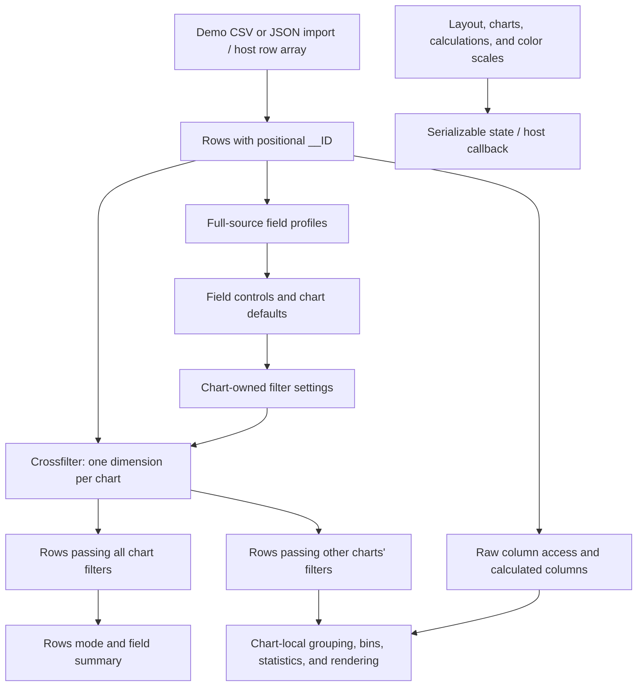

# explorEDA application feature inventory

Updated after the 2026-09-20 field, chart, and grouped-summary implementation. See the [current gaps and verification](transcript-gap-analysis.md).

Original audit: 2026-09-17, commit `a168f1b`. Current reviewed implementation: `f04e790` on `main`.

This document describes the current reviewed implementation. It covers the demo application and the public `exploreda` package. The companion [transcript gap analysis](transcript-gap-analysis.md) compares this behavior with the recorded product intent.

The application is a desktop workspace for one in-memory table. Users can inspect fields, create linked views, filter rows, define calculated columns, and arrange a dashboard. Eleven registered view types share one data store and one Crossfilter instance per workspace.

The strongest existing path is scalar data → field summary → charts and rows → linked filters. Field settings now preserve source values while applying runtime overrides and shared display rules. Saved workspace structures and a host callback exist. Named grouped summaries can feed read-only bar and table views. Durable saved views and general mark-level provenance do not exist.

## Contents

- [Scope and evidence](#scope-and-evidence)
- [System structure](#system-structure)
- [Input data and field profiles](#input-data-and-field-profiles)
- [Dashboard workspace](#dashboard-workspace)
- [Filtering and chart coordination](#filtering-and-chart-coordination)
- [Calculations and data transformations](#calculations-and-data-transformations)
- [Faceting](#faceting)
- [Axes, colors, labels, and common settings](#axes-colors-labels-and-common-settings)
- [Chart and view catalogue](#chart-and-view-catalogue)
- [Saved state, exports, and host integration](#saved-state-exports-and-host-integration)
- [Performance and resource use](#performance-and-resource-use)
- [Traceability and reproducibility](#traceability-and-reproducibility)
- [Accessibility, errors, and supported screens](#accessibility-errors-and-supported-screens)
- [Verification and documentation limits](#verification-and-documentation-limits)

## Scope and evidence

This is a source-based audit with automated checks. It is not a complete browser, visual, accessibility, or performance certification.

Evidence comes from active components, their data paths, chart definitions, parsers, state management, and tests. A type declaration, unused helper, demo label, or old plan does not establish working behavior.

Historical records describe baseline package checks and browser evidence. Current automated validation passed: package tests (198), demo tests (11), both builds and type checks, and `verify:lean` (742,700 bytes; 162,129 bytes gzip). Focused browser evidence appears in the [gap audit](transcript-gap-analysis.md#audit-limits). The [repair record](transcript-trust-fixes.md) and [calculation workflow](calculation-workflow.md) separate historical evidence from current status.

The audit covers all eleven registered view types. It also covers common settings, data ingestion, the separate Rows and Calculations modes, serialization, and source-derived performance limits. It does not claim that every combination of settings was exercised in a browser.

## System structure

The existing project uses React and TypeScript. The demo runs through Vite. Each `ExplorEda` instance owns a Zustand store, field profiles, calculation definitions, color scales, charts, and a Crossfilter wrapper.

This diagram shows responsibilities, not a persisted transformation graph. Most chart transformations execute inside their own renderer or helper. Their output cannot become another named source table.

The full package entry registers every chart. The `exploreda/core` entry exposes the chart registry. Individual `exploreda/charts/*` entries export chart definitions for selective registration. These entries support composition and bundle control; they do not provide a renderer-independent visualization language. The public chart type union still names the built-in chart types.

Sources: [workspace entry][entry], [data provider][provider], [Crossfilter wrapper][crossfilter], [registry][registry], [package exports][package], [build entries][build].

## Input data and field profiles

### Sources and loading

| Path             | Current behavior                                                                                                        | Boundary                                                                                 |
| ---------------- | ----------------------------------------------------------------------------------------------------------------------- | ---------------------------------------------------------------------------------------- |
| Host integration | The host passes an array of row objects through `data`.                                                                 | One source table per workspace; no source adapter or query protocol.                     |
| CSV upload       | File picker or drop target; Papa Parse uses headers, skips empty lines, and enables dynamic typing.                     | A parse error rejects the import. No type preview or per-column conversion controls.     |
| JSON upload      | Accepts one object or an array of objects. Nested objects become dotted fields. Arrays become indexed fields.           | Rich values become scalar columns. Null becomes undefined in this parser.                |
| Example data     | Fetches complete CSV files and opens optional saved dashboard settings.                                                 | Loading, cancellation of stale requests, HTTP errors, and retry are handled in the demo. |
| Data replacement | A new `data` reference rebuilds rows, profiles, calculations, and chart filtering state. Facet IDs follow the new rows. | Mutation of the same array reference does not trigger this replacement path.             |

The supported cell model is string, number, boolean, null, or undefined. Dates arrive as strings or numeric values. Field settings can override scalar type, define null tokens, and choose date input presets. There is no first-class duration, quantity, array, image, or related-record cell type.

Every row receives a positional `__ID`. This replaces a supplied property with the same name. IDs identify positions within the current load. They are not durable source keys across replacement, reordering, or different files.

JSON flattening is convenient for inspection but changes the source shape. An array of tags becomes fields such as `tags[0]`. A nested object becomes fields such as `address.city`. No schema or lineage record preserves the flattening operations. Pre-existing field names can also collide with generated paths.

Local files remain in browser memory. The demo does not upload imported data to a server. There is no streaming parser, load progress for large local files, cancellation during local parsing, row cap warning, or incremental column fetch.

### Field discovery and profiles

Field discovery scans the union of keys across all rows. It does not rely only on the first record. Internal `__ID` is excluded from the ordinary source field list. Calculated column names are added to the field catalogue separately.

The shared profile records inferred type, row count, missing count, distinct count, and suitable statistics. Numeric profiles include minimum, maximum, mean, median, and population standard deviation. Categorical profiles include value frequencies and common values.

Type detection considers non-null values. Boolean-like values take precedence, then numeric conversion, then date parsing, then categorical values. Mixed or entirely missing fields fall back to categorical behavior. Only null and undefined count as missing; blank strings are not a general missing-value category.

Profiles drive table filters and initial chart choices. The field inspector keeps canonical source names, while users can set a display label (alias), description, type override, null-token policy, date preset, unit, currency, format, and precision. Raw rows remain available for previews and full-analysis saves. Runtime overrides rebuild effective values, profiles, filters, calculations, and charts for that field. Other chart paths still have local eligibility rules, so one setting does not guarantee identical geometry everywhere.

Full-source profiles remain available for controls. The Summary view recalculates profiles from globally filtered rows. Its displayed statistics, and sometimes its inferred type, can change while table controls retain the original profile.

Sources: [CSV upload][upload], [CSV parser][csv], [JSON parser][json], [demo landing page][landing], [row initialization][state], [field profiles][profiles], [data provider][provider].

## Dashboard workspace

### Entry and initial views

The demo presents complete dashboards before component examples. Current examples include product activity, penguins, shop operations, Lorenz trajectories, distributions, categorical charts, legends, line charts, tables, FIFA, population, and NBA data.

An unsaved dataset starts with a summary, a source table, and one distribution chart. The distribution uses the first numeric field when available; otherwise it uses a row chart for the first field. The initial table includes all source fields.

The workspace has three modes:

- **Charts:** one dashboard of chart panels.
- **Rows:** one full-size table of the globally filtered source records, with additional local controls.
- **Calculations:** create, inspect, edit, and remove calculated columns.

These modes do not represent multiple named dashboards or independent analysis sessions.

### Panel operations

Users can add a registered chart, drag its header, resize its panel, duplicate it, delete it, expand it, or open its settings. New charts receive field defaults and appear below existing panels. The workspace scrolls to and focuses the new panel.

Duplication copies settings and active filters into a chart with a new ID. The copy becomes another filter owner. Deleting a chart removes its filter dimension as well as its panel. Removing every chart clears their dimensions. Destructive chart removal has confirmation controls.

Expansion displays a panel in an overlay sized to the window. Escape closes it. Expansion applies to the whole panel. Focus opens one facet in the facet view; individual facet cells cannot be pinned or expanded in the panel overlay.

The grid supports configurable column count, row height, container padding, and background markers. Layout positions and sizes belong to saved workspace state. Narrow-screen adaptation can display one column without rewriting the stored desktop layout.

### Settings and field actions

Chart settings use a local draft. Apply commits the draft; Reset discards draft changes. Most settings do not preview live on the chart. Changing chart type creates that type's defaults while preserving the panel identity and layout.

Data and Labels settings are common. Facets, Axes, and Spacing are exposed for row, bar, scatter, line, and box plots. Select settings expose numeric filter bounds for scatter, line, and bar charts. Those bounds define filters, not axis zoom limits.

Summary field actions can create charts directly. Numeric fields offer distribution and relationship views. Categorical fields offer count and pivot views. Date fields offer a pivot route. Chart defaults still choose other fields heuristically; the action is not a general field-role assignment workflow.

**View chart data** creates a data-table panel containing the fields used by a chart. It copies applicable field filters. It does not show the selected mark's contributing records or the chart's aggregated output. Because the new table is a chart, copied filters can themselves constrain the dashboard.

Sources: [workspace controls][manager], [grid][grid], [panel][panel], [chart creation][createcharts], [Rows mode][rowsview], [settings][settings], [example catalogue][examples].

## Filtering and chart coordination

### The three relevant populations

| Population             | Meaning                                                                  | Main consumers                                                                            |
| ---------------------- | ------------------------------------------------------------------------ | ----------------------------------------------------------------------------------------- |
| Full source            | Every loaded row.                                                        | Initial profiles, most chart domains, bin boundaries, category lists, calculated columns. |
| Globally filtered rows | Rows that pass every chart dimension.                                    | Active row count, Rows mode, Summary view.                                                |
| Peer-filtered rows     | Rows that pass every dimension except the current chart's own dimension. | Most chart rendering and aggregation.                                                     |

Crossfilter creates one dimension per chart, keyed by row ID. Each chart supplies its predicate. Predicates from different charts combine with AND, including multiple charts that filter the same field.

A chart's group omits that chart's own dimension. This lets a chart retain context for its own selection. For example, a row chart can display every category and dim unselected categories while other charts show only selected records. This does not imply that every renderer applies identical selection styling. Line paths, for example, retain their own unfiltered context beneath the brush.

There is no separate persistent working-set filter, global query layer, or user-defined group of linked charts. Separate workspace instances can be independent, but one workspace has one shared filter universe.

### Filter representations

| Filter        | Semantics in the common predicate                                                                                                           |
| ------------- | ------------------------------------------------------------------------------------------------------------------------------------------- |
| Values        | OR across selected values; strict typed equality. A selected null matches null and undefined.                                               |
| Numeric range | Inclusive minimum and maximum. Either bound can be absent. Finite numbers and nonblank numeric strings are accepted; booleans are excluded. |
| Text          | Case-insensitive contains, equals, starts-with, or ends-with. Applies to strings.                                                           |
| Date range    | Parses string dates. A date-only maximum includes the full day through `23:59:59.999Z`.                                                     |

Charts do not all use every filter representation. Scatter uses its X and Y ranges. Box plots filter their group field. Row charts filter their category field. Bars use the first applicable field filter. Pivot filters combine alternatives within a field, then intersect fields. Color legends compare typed category keys. The data table and line definition apply their configured filter lists.

These differences matter for numeric-looking categories, boolean-like strings, missing categories, and restored settings. A common filter type does not guarantee a common chart interpretation.

### Direct selection and filter status

Numeric bars and line charts support horizontal brushing. Scatter supports a two-dimensional rectangle. Users can draw, move, resize, or clear a selection. A small drag threshold separates clicks from drags. Pointer capture and cancellation handling support the gesture lifecycle.

The chart shows a draft brush during the gesture. Linked filters update when the gesture ends. Escape and a blank click outside the selection clear it. Manual numeric bounds provide another route to the same range settings.

Categorical row and bar marks, box groups, pivot headers, and categorical legend entries support value selection. They are alternatives to numerical brushing, not one shared gesture grammar.

The active-filter bar shows the number of rows left after chart filters. It lists removable filter chips and a clear-all action. Chips identify the owning chart. They do not navigate to that chart or show how several filters intersect numerically.

### Table scope is different

Dashboard table **field filters** participate in linked chart filtering. Dashboard table **search** is local to that table. Search includes raw and calculated fields, including hidden columns. It excludes internal `__ID` values.

The separate Rows mode receives globally filtered records, then applies its own local field filters and search. Its controls do not constrain dashboard charts. They are not emitted in saved workspace state.

Clear all filters clears chart filters, dashboard table searches, and local Rows filters/search. Table counts state their local scope. Before reset, those counts can differ from the global chart-filter count.

Sources: [Crossfilter wrapper][crossfilter], [common predicates][filter], [brush hook][brush], [filter status][filterstatus], [table filtering][tablerows], [Rows mode][rowsview], individual chart definitions linked below.

## Calculations and data transformations

### Calculated columns

Calculated fields have an ƒx inspector in charts, tables, Summary, and field selectors. The shared editor includes live draft preview, per-row inputs/results, and a selectable dependency tree. See the [calculation workflow](calculation-workflow.md).

The Calculations mode creates, validates, edits, previews, and removes derived fields. Validation executes the candidate against all loaded rows. Preview supports paging, failed-only rows, counts, and per-row reasons. Runtime definitions preserve parsed trees, while persistence stores formula strings and parses them on restore. There is no AST compatibility layer.

Dependencies execute before their consumers and share cached values. Formula edits preserve active thresholds and recompute chart predicates, tables, summaries, and facets. Invalid replacements leave the old definition intact. Cycles, missing dependencies, and source-name collisions are rejected.

Rename/delete is blocked while a field is used by charts or other calculations. This avoids broken references. Automatic consumer rewrites remain absent.

### Supported expressions

| Area             | Behavior                                                                                           | Boundary                                                                                                                |
| ---------------- | -------------------------------------------------------------------------------------------------- | ----------------------------------------------------------------------------------------------------------------------- |
| Arithmetic       | Addition, subtraction, multiplication, division, exponentiation, unary plus/minus.                 | Finite numeric values and nonblank numeric strings are accepted. Invalid values and division by zero report row errors. |
| Functions        | `sum`, `avg`, `min`, `max`, `count`, `formatDate`, `extractDateComponent`; case-insensitive names. | Arguments belong to one row. `count(x, y)` returns two. Active help comes from the runtime registry.                    |
| Conditions       | Ternary and `if … then … else …`, with lazy branch evaluation.                                     | Strings, booleans, arithmetic, and functions can appear in branches.                                                    |
| Comparison/logic | Numeric ordering, typed equality, AND/OR, and negation.                                            | Null and undefined compare as missing. AND/OR short-circuit.                                                            |
| Fields           | Identifiers with letters, digits, and underscores.                                                 | Use `["Order Date"]` for spaced, reserved, dotted, or indexed field names. Field insertion adds this form.              |
| Strings          | Quoted text is distinct from a field reference.                                                    | General text transformation functions remain absent.                                                                    |
| Dates            | UTC formatting and year/month/day/quarter/ISO-week extraction.                                     | ISO dates and timestamps without offsets use UTC; explicit offsets retain their instant.                                |

Tables, filters, exports, charts, and previews use the same calculated columns. Valid row results remain available when other rows fail. Failed table cells show Error with a reason. The preview separates these failures from valid missing values.

The unused FunctionExplorer and ValidationPanel components remain outside the active form. Their mock content is not the supported function contract.

### Named grouped summaries

Grouped summaries store one named definition with an ID. The definition has one group field and one aggregation: count, sum, or average. Sum and average require one measure field.

Results use globally filtered source IDs and effective field values. Each group keeps exact source IDs, effective inputs, raw measure inputs, inclusion state, and exclusion reasons. A read-only bar chart and data table can reference the same saved definition by ID. Their inspector shows grouped rows and paged contributors.

Grouped summaries remain a bounded reuse slice. They do not provide pivot-as-source reuse, joins, nested groups, window functions, regression tables, density outputs, or a general transformation graph.

### Chart-local transformations

Histogram bins, category counts, pivot aggregates, box statistics, violin densities, and line reduction still transform data inside chart code. Named grouped summaries are the exception described above. Other chart transformations are not reusable nodes in a common dataflow system.

There are no user-defined joins, pivots-as-sources, regression tables, confidence bands, principal components, or reusable density outputs. Group, rank, and advanced expression shapes in types do not have corresponding active evaluator support.

Sources: [calculation UI][calcui], [form][calcform], [parser][parser], [evaluator][calculator], [calculation manager][calcstate], [function registry][functions], [field settings](../packages/explorEDA/src/lib/fieldSettings.ts), [grouped aggregates](../packages/explorEDA/src/lib/aggregates.ts), [data provider][provider].

## Faceting

### Layout and grouping

Faceting is exposed for row, bar, scatter, line, and box plots. The panel repeats the chart renderer with one shared chart ID and subsets of source row IDs.

| Mode | Current behavior                                                                                                       |
| ---- | ---------------------------------------------------------------------------------------------------------------------- |
| Wrap | Groups by one field. Configured columns range from one to ten. Available width reduces the actual column count.        |
| Grid | Groups by a row field and a column field. Renders their Cartesian layout and displays empty combinations as “No data.” |

Groups come from the full loaded source. They do not disappear merely because another chart filters out their records. Both layouts follow group discovery unless visible facets are selected and reordered. Facet headers can filter a facet value. Wrap and grid layouts page crowded groups, and each facet can open in a focused view. There is no top-N, pin, or nested facet control.

The settings panel can select visible groups and reorder the selected chips. `visibleFacetIds` stores that ordered subset for both layouts. Wrap and grid pages fit their minimum cell dimensions, so a large facet set uses paging instead of internal facet scrolling. Layouts reserve space for headers, paging controls, and axis labels.

Facet keys preserve source types and both grid coordinates. Values containing `__` remain intact. Null and undefined share `(missing)`. Ambiguous text labels use quotes, so number `1` and text `"1"` remain distinct.

### Shared domains and selection

All supported facet families derive domains directly from the current full source. There is no accumulating axis-registration provider.

| Chart   | Shared domain behavior                        |
| ------- | --------------------------------------------- |
| Scatter | Full-source numeric X and Y.                  |
| Bar     | Full-source bins/categories and count domain. |
| Row     | Full-source category order and count domain.  |
| Box     | Full-source group categories and numeric Y.   |
| Line    | Full-source X and left/right Y domains.       |

The facet header states the scale population and cross-facet selection scope. Header values can toggle the parent chart filter. A Focus action opens one facet at a larger view, and Back returns to the layout. Field changes recompute their source extents.

All cells edit the parent chart's filters. A scatter brush selects its X/Y range across the dataset. It does not automatically add the row and column facet keys. There is no switch between “this facet only” and “all facets.” Header selection filters the chosen facet field, while focus changes the display view only.

Sources: [facet container][facet], [wrap layout][wrap], [grid layout][facetgrid], [facet settings][facetsettings], chart renderers below.

## Axes, colors, labels, and common settings

### Position scales and labels

The common numerical scale helper implements linear and symmetric-log scales. The settings UI exposes those choices. Type declarations also mention logarithmic and time scales, but the helper falls back to linear for those values. True date axes and logarithmic behavior are not established by those declarations.

Supported 2D facet domains derive from the full source, rather than each facet or the globally filtered subset. This stabilizes brushing comparisons. There is no common control for domain population, manual domain bounds, or chart zoom with reset. Axis `min` and `max` properties are not broadly consumed by the active numerical renderers.

Common charts provide axis labels, chart titles, margins, grid lines, and density controls. Tick density adjusts to available pixels. Numeric ticks use `en-US` formatting, compact notation at large magnitudes, and limited decimal places. Category labels can truncate with an SVG title containing the complete text.

Field settings provide shared labels and value formatting for numbers, currency, percentages, dates, datetimes, units, and precision. The formatter is used by table cells, chart labels and tooltips, facet labels, pivot values, and legends. Explicit chart axis labels override field labels; blank labels inherit them. Multiple measures on one axis still need a shared formatting policy.

### Color scales

Charts refer to shared color scales by ID. Scale creation reuses an unambiguous chart binding or a scale with the same source field. Display names do not control reuse. Numerical palettes include Viridis, Inferno, Magma, Plasma, Warm, and Cool. Categorical choices include Category10 and Set3, plus individual category colors.

The Color Scale Manager lets users search scales, rename them, edit numerical bounds, choose palettes, and edit category colors. Changes use a local draft with Save Changes and Reset.

Automatic color typing uses the effective field profile, or inference for calculated fields. Numerical scales use finite converted values. Numerical bounds are set when a scale is created; they are not a declared all/working/visible population policy.

A chart with a color field and bound scale automatically shows a legend for that exact scale ID. The legend uses the field display label and shared value formatter. A Color Legend panel can show multiple explicit fields, resolve their source-field scales, and filter categorical values. Numerical legends show gradients without brushing. Line series have their own palette and legend system.

Sources: [axis controls][axissettings], [scale helper][numeric], [axis rendering][axes], [base chart][basechart], [color hooks][colors], [color editor][coloreditor].

## Chart and view catalogue

### Catalogue at a glance

| Registered type | Input and result                                           | Direct filtering                              |
| --------------- | ---------------------------------------------------------- | --------------------------------------------- |
| `row`           | Category → horizontal count bars.                          | Category selection.                           |
| `bar`           | Numeric field → histogram; categorical field → count bars. | Numeric brush or category selection.          |
| `scatter`       | Two numerical fields → row-level points.                   | X/Y rectangle.                                |
| `line`          | Numeric X and multiple Y columns → one line per column.    | X range.                                      |
| `boxplot`       | Numeric field, optional group → distribution summaries.    | Group selection.                              |
| `3d-scatter`    | Three numerical coordinates → WebGL points.                | Receives other filters; creates none.         |
| `pivot`         | Row groups, column group, measures → aggregates.           | Row/column header values.                     |
| `data-table`    | Selected raw fields → records.                             | Linked field filters in panels; local search. |
| `summary`       | Fields → profiles of globally filtered rows.               | No own filter; field actions create charts.   |
| `color-legend`  | Color fields → categories or numerical gradient.           | Categories only.                              |
| `markdown`      | Saved rich-text content → editable explanation.            | None.                                         |

### Row chart

The row chart counts source records by category. It is not a horizontal bar renderer for arbitrary supplied measures.

Categories are ordered by their full-source frequency across all facets. Filtering other charts changes counts without using those new counts to reorder the categories. Row heights adapt within configured limits. Categories that do not fit collapse into an **Other categories** row. This remainder cannot be selected.

Counts appear as labels. Clicking or using the keyboard toggles categories. Unselected values remain visible with subdued styling. The collapsed remainder has no drill-down action. Real categories named Others remain selectable.

Missing categories use the common null filter behavior. Typed values retain separate labels and selections. There is no measure selection, custom category ordering, or list of hidden categories.

Source: [row chart implementation](../packages/explorEDA/src/components/charts/RowChart/RowChart.tsx), [definition](../packages/explorEDA/src/components/charts/RowChart/definition.ts).

### Bar chart and histogram

For numerical data, the chart constructs equal-width bins over the full field extent. The default is ten bins; the bin utility bounds requested counts. A constant field receives an expanded extent. The final bin includes the maximum value.

Counts use peer-filtered rows. Bin definitions remain stable when another chart filters the data. The Y domain retains the full-population maximum count with padding. Users can change the bin count and brush a numerical range.

For categorical data, the chart counts typed values and supports category selection. **Force string** selects category mode for numbers. Selection retains each original value and type.

Selection color for numeric bins tests a bin's start value. A bin that overlaps a brush boundary can therefore have a count/selection appearance that needs closer interpretation. The range filters individual values, not whole-bin membership.

Color applies to bins or categories. A bar can also reference a named grouped summary and render its count, sum, or average result. This path is read-only and uses globally filtered effective values. Stacked bars, grouped bars, percentage bars, and arbitrary supplied measures remain absent.

Source: [bar renderer](../packages/explorEDA/src/components/charts/BarChart/BarChart.tsx), [definition](../packages/explorEDA/src/components/charts/BarChart/definition.ts), [bin utilities](../packages/explorEDA/src/components/charts/BarChart/bins.ts).

### Two-dimensional scatter plot

Scatter plots show one point per usable row. X and Y accept finite numerical values and numeric strings. Null, blank, and nonfinite coordinates are excluded. Users can select X/Y fields, color, point size, and opacity.

Points render on Canvas. Axes, hover guides, and brushing use SVG. Domains use source values with padding and can participate in facet sharing. Points excluded by the chart's own brush remain as faint context; records excluded by other charts disappear.

Hover finds a nearby point and shows crosshairs, coordinate values, and available color context. The search scans live points. There is no point-to-record inspector or point-level keyboard navigation.

There is no lasso, variable point-size encoding, deterministic jitter control, regression, confidence interval, two-dimensional density layer, or connected path per group.

Source: [scatter renderer](../packages/explorEDA/src/components/charts/ScatterPlot/ScatterPlot.tsx), [definition](../packages/explorEDA/src/components/charts/ScatterPlot/definition.ts).

### Line chart

The line chart expects a numerical X field and a list of numerical Y fields. Each Y column becomes a separate series. The default X choice can use positional `__ID`. A categorical group column does not generate multiple long-format series.

Per-series settings include line color, width, opacity, solid/dashed/dotted style, point visibility, point size, point opacity, and left/right axis assignment. Curve choices include linear, monotone, and step. Users can show a static legend at any of four positions.

Missing or invalid values break paths. Hover locates nearby series values and displays crosshairs. A horizontal brush filters the workspace, while the line itself retains context for its own filter.

Large series use width-related reduction that preserves representative first/minimum/maximum points within buckets. Input is ordered by finite X before rendering and reduction. Constant-X reduction still needs care because the reduction path can collapse data sharply.

X and Y extents use the full source. Facets therefore retain the same comparison domains under peer filtering. Left and right axes are independent. There is no date-aware axis, long-format grouping, line-per-row/slope view, stacked area, regression series, or click-to-hide legend.

Source: [line renderer](../packages/explorEDA/src/components/charts/LineChart/LineChart.tsx), [definition](../packages/explorEDA/src/components/charts/LineChart/definition.ts), [reduction utility](../packages/explorEDA/src/lib/chartUtils.ts).

### Box plot, violin, and beeswarm

The box plot summarizes one numerical field. An optional color field supplies groups and group colors. String and numeric groups are accepted. Missing and boolean group values do not become ordinary groups.

Quartiles use interpolated positions. The box shows the middle half and median. Whisker choices are Tukey-style fences, minimum/maximum, or mean ± two population standard deviations. The Tukey branch computes theoretical fences, then chooses observed values nearest those fences. Outliers remain values outside the selected observed endpoints.

Users can show outliers, a violin overlay, a beeswarm overlay, or both overlays. Tooltips expose group size, median, middle-half range, whisker range, and outlier details. Clicking a group filters by its category while preserving comparison context.

The violin uses a Gaussian density estimate at 100 evaluation points. Automatic bandwidth follows a Silverman-style calculation; a manual bandwidth setting also exists. Each group's peak width is normalized independently. Violin width therefore does not compare group population or absolute peak density directly.

The beeswarm uses deterministic sampling up to 1,000 points per group and a bounded placement search. Collision distances use the chart's screen-space Y scale, so value ranges keep one visual meaning. It remains a heuristic and does not retain source row IDs.

Group order can follow labels or population medians. Full-source groups and numerical domains help preserve context. Style controls cover box, median, whisker, and outlier appearance, although some stored color properties are not used independently by the renderer.

Aggregated statistics and outlier values do not retain source row IDs. There is no numeric brush on the box or reusable statistics table output.

Source: [box renderer](../packages/explorEDA/src/components/charts/BoxPlot/BoxPlot.tsx), [statistics and overlays](../packages/explorEDA/src/components/charts/BoxPlot/boxPlotCalculations.ts), [definition](../packages/explorEDA/src/components/charts/BoxPlot/definition.ts).

### Three-dimensional scatter plot

The 3D view uses Three.js and OrbitControls. Users can orbit, pan, and zoom the camera. Camera position and target are saved after a short debounce. Settings include X/Y/Z fields, color, point size, opacity, axes, and grids.

Points use raw numerical coordinates. The axes and grid are fixed scene helpers, not fully labeled data-domain axes. Numerical axis settings do not establish the same scaling behavior as the two-dimensional charts.

The data hook reads an optional size field and maps finite values to per-point shader sizes. Rows with missing or nonfinite coordinates are omitted and counted in a status message. Invalid size values use the base point size.

The view receives filters from other charts and creates no filter itself. There is no 3D brushing, picking tooltip, point provenance, or point-level keyboard equivalent.

Rendering responds to scene and camera changes. It does not run a permanent animation loop. Cleanup disposes controls, geometry, material, and the renderer. Device pixel ratio is capped for WebGL rendering.

Source: [3D renderer](../packages/explorEDA/src/components/charts/ThreeDScatter/ThreeDScatterChart.tsx), [data hook](../packages/explorEDA/src/components/charts/ThreeDScatter/useThreeDScatterData.ts), [points](../packages/explorEDA/src/components/charts/ThreeDScatter/ThreeDScatterPoints.tsx), [axes](../packages/explorEDA/src/components/charts/ThreeDScatter/ThreeDScatterAxes.tsx).

### Pivot table

The pivot supports multiple row fields, one column field, and multiple measure fields. Supported aggregates are sum, count, average, minimum, maximum, median, mode, population standard deviation, population variance, unique count, and single value.

Numeric aggregates exclude missing, blank, boolean, and nonfinite values. Count counts rows. Unique count and mode have different missing-value semantics from numeric aggregates. Single value reports a cell-local error when a group does not contain exactly one distinct value, so other cells remain available.

Row groups use typed tuples. This avoids simple string-key collisions. Column ordering remains a basic sort. The table scrolls with sticky headers and group columns. Numerical display uses fixed precision rather than field-specific formatting.

Row and column header buttons filter their fields. Alternatives within one field combine with OR; fields combine with AND. The pivot retains its own unselected context because its aggregates use peer-filtered rows.

Calculated measures are supported through column access. Missing field names produce a specific recovery alert. Pivot cells expose an inspector with stable source IDs, grouping keys, inputs, included and excluded rows with reasons, aggregation, result, and error. Contributors are paged in groups of 50. Other aggregate errors do not have a general chart-level error boundary.

There are no grand totals, subtotals, collapsible hierarchies, percent-of-row/column/grand-total calculations, previous-period differences, or pivot-as-source reuse. Named grouped summaries provide contributor inspection and a separate one-group reuse path for count, sum, and average.

Source: [pivot renderer](../packages/explorEDA/src/components/charts/PivotTable/PivotTable.tsx), [aggregations](../packages/explorEDA/src/components/charts/PivotTable/utils/calculations.ts), [definition](../packages/explorEDA/src/components/charts/PivotTable/definition.ts), [missing-field handling][renderer].

### Data table and Rows mode

The table displays selected source and calculated scalar fields. It supports a column chooser, single-column sorting, field filters, text search, width changes, row counts, scrolling, and CSV export.

Selected field badges can be reordered by pointer or keyboard in the settings selector. There is no direct header drag reordering. Existing column objects and widths remain when a selected field stays selected. Provider-owned Rows settings serialize filters, search, sort, column order, and widths.

Headers and the first column remain visible during scrolling. The body uses fixed-height virtual rows, not pagination. It renders the viewport plus a small overscan. Column widths have a name-based default, a minimum width, pointer resizing, and keyboard resizing. There is no content-measured auto-fit or double-click fit.

Sorting toggles ascending/descending on one column. It compares numeric values numerically when possible, then uses string comparison. Embedded numbers use natural ordering, such as `run2` before `run10`. There is no third click to restore source order.

Field controls depend on the full-source profile:

- Numbers: minimum and maximum inputs.
- Dates: date inputs for lower and upper bounds.
- Boolean and small categorical sets: value choices, including missing where applicable.
- Larger text/category sets: contains, equals, starts-with, or ends-with controls.

Nullish cells show a dash. Failed calculations show Error, with a reason in the cell title. Booleans show Yes/No. Numbers align right. Other values align left. Field settings provide display labels and shared formats. Cells use a compact single-line presentation with a title for the raw value. There are no rich cells, inline editing, row bookmarks, or conditional formatting rules.

Search is a case-insensitive substring search over source and calculated values, including hidden fields. It excludes `__ID`. It does not search field names, highlight matches, or offer fuzzy matching.

CSV export includes all matching rows and selected columns in displayed sort order. It includes calculated values beyond the rendered window. Headers and cells escape CSV punctuation.

Display, search, sort, filters, and export share resolved calculated values. Header filter controls use profiles built from those values.

The separate Rows mode adds local filters after global chart filtering. Provider-owned Rows settings serialize with dashboard state. Its column list includes newly added calculations. A data-table chart with an `aggregateId` instead shows the reusable grouped result and its contributor inspector.

Sources: [table renderer][table], [body][tablebody], [header][tableheader], [toolbar and export][tabletoolbar], [raw-row filtering][tablerows], [column settings][tablesettings], [sortable selector][multiselect], [Rows mode][rowsview].

### Summary table

Summary lists all available fields, including calculations. It recalculates profiles using globally filtered IDs. With no matching records, it retains a useful empty field list and original type context.

The compact display shows canonical field names through display labels (aliases), type icons, distinct counts, ranges or common values, and missing-value information. Users can open a field inspector, sort the field list, and create suitable charts through field actions.

The CSV export includes more detail than the compact view: counts, missing values, numerical statistics, and common values. Headers and cells escape embedded quotes.

The field inspector shows inferred and effective types, counts, raw/runtime examples, conversion failures, and editable labels, descriptions, formats, units, precision, currencies, date presets, null tokens, and type overrides. Applying a type-related setting rebuilds effective values and clears filters for that field. Summary has no independent filter dimension, inline histograms, calendar heatmaps, or missing-value matrix.

Source: [summary renderer](../packages/explorEDA/src/components/charts/SummaryTable/SummaryTable.tsx), [field profiles][profiles].

### Color legend

The Color Legend view supports multiple fields. Categorical entries show colors and counts, expose selected state, and toggle filters. Multiple selected values form alternatives; different legend fields intersect.

Numerical fields show a gradient and breakpoints. The gradient does not support brushing. Wrap and breakpoint controls affect layout. Categorical legends include a selectable missing group.

Categorical values retain source types. Quoted labels distinguish ambiguous text values. A single-field legend reuses the scale bound to that field or its explicit scale ID; chart legends use their exact bound scale ID.

Source: [legend files](../packages/explorEDA/src/components/charts/ColorLegend/), [definition](../packages/explorEDA/src/components/charts/ColorLegend/definition.ts), [color hooks][colors].

### Markdown / explanation panel

The view named Markdown is a Tiptap rich-text editor. It stores HTML content in chart settings. It is not a Markdown source editor or notebook execution system.

Its toolbar supports paragraphs, six heading levels, bold, italic, strikethrough, inline code, code blocks, lists, blockquotes, horizontal rules, line breaks, formatting removal, undo, redo, and a preset text color. Users can hide the toolbar or choose icon/text display modes.

Content edits update workspace state. The panel scrolls as needed. It has no data-bound interpolation, generated analytical summary, chart annotations, or relationship to selected records.

Source: [editor](../packages/explorEDA/src/components/charts/Markdown/Markdown.tsx), [toolbar](../packages/explorEDA/src/components/charts/Markdown/MenuBar.tsx).

## Saved state, exports, and host integration

| Capability       | Current contract                                                                                                       |
| ---------------- | ---------------------------------------------------------------------------------------------------------------------- |
| Saved workspace  | Charts and settings/filters/layouts, formula-string calculations, color scales, grid settings, metadata, Rows settings, field settings, and grouped definitions. |
| Source data      | Passed separately for primary settings restore. A full analysis bundle also includes raw rows and preserves undefined/nonfinite values. |
| Host callback    | `onStateChange` emits storage-neutral settings JSON when relevant workspace state changes.                                  |
| Restore          | `savedData` restores settings against current rows. Restore validates calculations and settings before replacement.      |
| Clipboard        | The package and demo support copy/open settings JSON and copy/open full analysis JSON.                                      |
| Table download   | CSV of selected source/derived columns and matching rows in displayed order.                                           |
| Summary download | CSV of current field profiles.                                                                                         |
| Demo URL         | Identifies an example or coverage page. It does not encode the live analysis.                                          |

Categorical color maps serialize as entry arrays. 3D camera vectors serialize as plain X/Y/Z objects and are restored to runtime vectors.

The callback compares a fingerprint of charts, calculations, colors, grid settings, Rows settings, field settings, and grouped definitions. Cache-only changes do not cause a new emitted state when that fingerprint stays equal. Prop-driven restoration suppresses feedback emissions.

Metadata is regenerated as “Untitled,” version 1, with fresh timestamps. It does not preserve a user-owned view identity or original creation time. The version migration helper currently returns the structure unchanged.

The saved-data validator checks nested structures, field settings, grouped definitions, and accepts linear and symlog. Native settings JSON rejects nonfinite filter values. The full analysis codec tags and restores undefined, NaN, Infinity, and -Infinity raw values. The calculation manager checks dependencies and supported functions before restore replaces state. `parseSavedAnalysis` handles the secondary full bundle with rows. The host still owns durable named/server storage.

Restore validates and installs calculations before rebuilding chart predicates. A focused integration check verifies a saved calculated-field threshold against the restored values.

The demo remembers emitted state only in memory to support reset behavior. There is no durable save/load library, autosave, named view selector, shareable live-state URL, undo history for dashboard actions, or data-version binding. Draft calculations remain session-local. `modifiedAt` records the snapshot time. Markdown editor undo is local to its content editor.

There is no built-in chart image, SVG, PDF, or complete dashboard export. Clipboard configuration and CSV downloads are the current export paths.

Sources: [data provider][provider], [saved schema](../packages/explorEDA/src/types/SavedDataStructure.ts), [serialization types](../packages/explorEDA/src/types/SavedDataTypes.ts), [save utilities][save], [demo landing page][landing], [workspace menu][manager].

## Performance and resource use

### Existing measures

| Area          | Existing measure                                                            | What it does not establish                                                                       |
| ------------- | --------------------------------------------------------------------------- | ------------------------------------------------------------------------------------------------ |
| Row tables    | Fixed-height virtualization and overscan.                                   | Sorting and filtering still process full in-memory row collections. Columns are not virtualized. |
| 2D scatter    | Canvas points with SVG guides.                                              | Point preparation and hover still scan data.                                                     |
| Line charts   | Width-related point reduction.                                              | Reduction is not reusable across views and has ordering/constant-X edge cases.                   |
| Box plots     | Beeswarm sample capped per group.                                           | Summary statistics and violin work still cover relevant values and groups.                       |
| Filtering     | Crossfilter dimensions, groups, and shared row IDs.                         | Every chart adds a dimension and associated data.                                                |
| Column access | Raw and calculated column caches.                                           | Cache writes are synchronous. Formula edits clear all calculated caches.                         |
| 3D            | Buffer geometry, event-driven rendering, cleanup, capped pixel ratio.       | No measured upper point limit or device guarantee.                                               |
| Loading       | Lazy workspace import; modular package exports; bundle verification script. | Full workspace still registers all built-ins once loaded.                                        |

### Scaling limits visible in source

Data, indexes, raw column maps, calculated result maps, chart groups, and rendering arrays can coexist in memory. Profiles inspect whole columns; statistics can sort values. Tables scan records for filtering and sorting. Faceting repeats chart work across groups.

Crossfilter refresh collects groups for every registered chart. General chart-setting updates can reapply a predicate even when a style change caused the update. The saved-state subscriber serializes a workspace fingerprint on store changes, including changes that do not eventually emit a callback.

Calculation execution builds per-row variable maps and reuses cached dependency results. There is no worker-thread calculation service, server aggregation, query pushdown, streaming, progressive result display, or explicit loaded/total count distinction.

On 2026-09-20, a desktop browser walkthrough covered a 10,000-row sample. This does not establish a general capacity envelope. There was no size sweep, memory profile, frame-rate test, or long-session stability run. Existing bundle checks concern import composition, not interactive scalability.

Sources: [table body][tablebody], [Crossfilter wrapper][crossfilter], [provider][provider], [calculation manager][calcstate], [line reduction](../packages/explorEDA/src/lib/chartUtils.ts), [lean bundle check](../packages/explorEDA/scripts/verify-lean-bundle.mjs).

## Traceability and reproducibility

The application preserves useful configuration evidence: field names, calculation text and dependencies, active chart filters, layouts, color choices, and saved chart settings. Tooltips expose some computed values. Raw rows can be viewed and exported.

Scalar calculations now expose source-row inputs, saved and draft values, dependency trees, and downstream uses. Pivot cells and named grouped summaries expose exact contributor inputs and stable source IDs. Complete mark provenance remains absent for ordinary bars, boxes, violins, lines, and other chart-local aggregates. There is no source checksum or data-version binding.

**View chart data** is a field-oriented raw table shortcut for ordinary charts. It does not materialize bins, pivot outputs, density samples, line reduction buckets, or the records that produced one selected mark. A data-table chart with an aggregate ID uses the separate named grouped-summary path.

Calculated columns retain expression dependencies and per-row errors, but not execution history. Positional IDs do not bind saved filters to a specific source version. File name, source checksum, row grain, schema, and transformation lineage are absent from saved state.

Several local computations are deterministic, including fixed-seed beeswarm sampling. That is not an end-to-end reproducibility contract. ISO date calculations use UTC. Source order can still affect line paths, and saved metadata is regenerated.

Sources: [panel data action][panel], [chart field selection](../packages/explorEDA/src/components/charts/chartAccessibility.ts), [calculation manager][calcstate], [data provider][provider], chart helpers above.

## Accessibility, errors, and supported screens

The intended screen target is desktop, documented at 1,024 CSS pixels and wider. Responsive grid behavior and smaller-screen fallbacks exist, but they do not establish a supported mobile experience.

Chart panels have names and descriptions. Common SVG charts include accessible grouping. Category marks and pivot headers expose keyboard actions. Brush controls have Escape behavior and numerical input alternatives. Data tables use semantic table markup, captions, row counts, visible sort state, and keyboard width controls. Filter and row counts use live announcements.

These measures do not make Canvas/WebGL points individually accessible. Brush creation remains pointer-driven. Expanded panels and every settings flow were not audited for complete focus behavior. Chart layout drag/resize does not have a verified equivalent keyboard workflow. Calculation icon actions have accessible names.

The demo reports file and fetch errors. Calculation validation reports syntax, dependency, function, and per-row execution errors. Pivot detects missing fields. Empty data tables, empty summaries, and empty facet combinations have explicit display paths. Other invalid numerical populations and aggregate failures have less consistent handling. The general chart renderer has no per-chart exception boundary.

Sources: [chart accessibility helpers](../packages/explorEDA/src/components/charts/chartAccessibility.ts), [base chart][basechart], [table header][tableheader], [panel][panel], [chart renderer][renderer], [upload][upload].

## Verification and documentation limits

The historical review fixed stale facet IDs after data replacement and non-finite category collisions. The approved source changes and combined checks are recorded in the [gap audit](transcript-gap-analysis.md#audit-limits). The 390×844 overflow finding remains a parked desktop-scope limitation.

Automated checks cover useful behavior such as field settings, grouped aggregates, field profiles, predicates, calculation arithmetic, state handling, serialization checks, table controls, chart utilities, and accessibility helpers. Focused browser checks supplement these tests; they do not establish every feature combination described here.

The original probes found parser/evaluator mismatches, local-time date output, and saved-state rejection of symlog. Those paths are repaired. The companion audit records current evidence and remaining findings.

Several older documents and the demo coverage manifest lag current code. Examples include references to pagination after table virtualization, and plans that list field profiles or the public state callback as future work. Coverage labels such as “supported” and “not checked” are manually maintained evidence, not a runtime feature detector.

This inventory includes the approved trust, calculation, chart, restore, and pivot source changes as source status. Other transcript ideas retain their original scope status.

[entry]: ../packages/explorEDA/src/components/ExplorEda.tsx
[provider]: ../packages/explorEDA/src/providers/DataLayerProvider.tsx
[crossfilter]: ../packages/explorEDA/src/hooks/CrossfilterWrapper.ts
[registry]: ../packages/explorEDA/src/charts/registry.ts
[package]: ../packages/explorEDA/package.json
[build]: ../packages/explorEDA/tsup.config.ts
[upload]: ../apps/demo/src/CsvUpload.tsx
[csv]: ../apps/demo/src/csvParser.ts
[json]: ../apps/demo/src/jsonParser.ts
[landing]: ../apps/demo/src/LandingPage.tsx
[state]: ../packages/explorEDA/src/providers/lib/dataLayerState.ts
[profiles]: ../packages/explorEDA/src/lib/fieldProfiles.ts
[manager]: ../packages/explorEDA/src/components/PlotManager.tsx
[grid]: ../packages/explorEDA/src/components/ChartGridLayout.tsx
[panel]: ../packages/explorEDA/src/components/PlotChartPanel.tsx
[createcharts]: ../packages/explorEDA/src/hooks/useCreateCharts.ts
[rowsview]: ../packages/explorEDA/src/components/RowsView.tsx
[settings]: ../packages/explorEDA/src/components/ChartSettingsContent.tsx
[examples]: ../apps/demo/src/demos/examples.ts
[filter]: ../packages/explorEDA/src/hooks/applyFilter.ts
[brush]: ../packages/explorEDA/src/hooks/useBrush.tsx
[filterstatus]: ../packages/explorEDA/src/components/ActiveFilterStatus.tsx
[tablerows]: ../packages/explorEDA/src/components/charts/DataTable/filteredRows.ts
[calcui]: ../packages/explorEDA/src/components/calculations/CalculationManager.tsx
[calcform]: ../packages/explorEDA/src/components/calculations/CalculationForm.tsx
[parser]: ../packages/explorEDA/src/lib/calculations/parser/semantics.ts
[calculator]: ../packages/explorEDA/src/lib/calculations/engine/Calculator.ts
[calcstate]: ../packages/explorEDA/src/lib/calculations/CalculationState.ts
[functions]: ../packages/explorEDA/src/lib/calculations/functions/registry.ts
[facet]: ../packages/explorEDA/src/components/charts/FacetRelated/FacetContainer.tsx
[wrap]: ../packages/explorEDA/src/components/charts/FacetRelated/FacetWrapLayout.tsx
[facetgrid]: ../packages/explorEDA/src/components/charts/FacetRelated/FacetGridLayout.tsx
[facetsettings]: ../packages/explorEDA/src/components/settings/FacetSettingsTab.tsx
[axissettings]: ../packages/explorEDA/src/components/settings/AxisSettingsTab.tsx
[numeric]: ../packages/explorEDA/src/components/charts/Axis/numericScale.ts
[axes]: ../packages/explorEDA/src/components/charts/Axis/Axis.tsx
[basechart]: ../packages/explorEDA/src/components/charts/BaseChart.tsx
[colors]: ../packages/explorEDA/src/hooks/useColorScales.ts
[coloreditor]: ../packages/explorEDA/src/components/ColorScaleManager.tsx
[renderer]: ../packages/explorEDA/src/components/charts/ChartRenderer.tsx
[table]: ../packages/explorEDA/src/components/charts/DataTable/DataTable.tsx
[tablebody]: ../packages/explorEDA/src/components/charts/DataTable/DataTableBody.tsx
[tableheader]: ../packages/explorEDA/src/components/charts/DataTable/DataTableHeader.tsx
[tabletoolbar]: ../packages/explorEDA/src/components/charts/DataTable/DataTableToolbar.tsx
[tablesettings]: ../packages/explorEDA/src/components/charts/DataTable/DataTableSettingsPanel.tsx
[multiselect]: ../packages/explorEDA/src/components/ui/multi-select.tsx
[save]: ../packages/explorEDA/src/utils/saveDataUtils.ts
