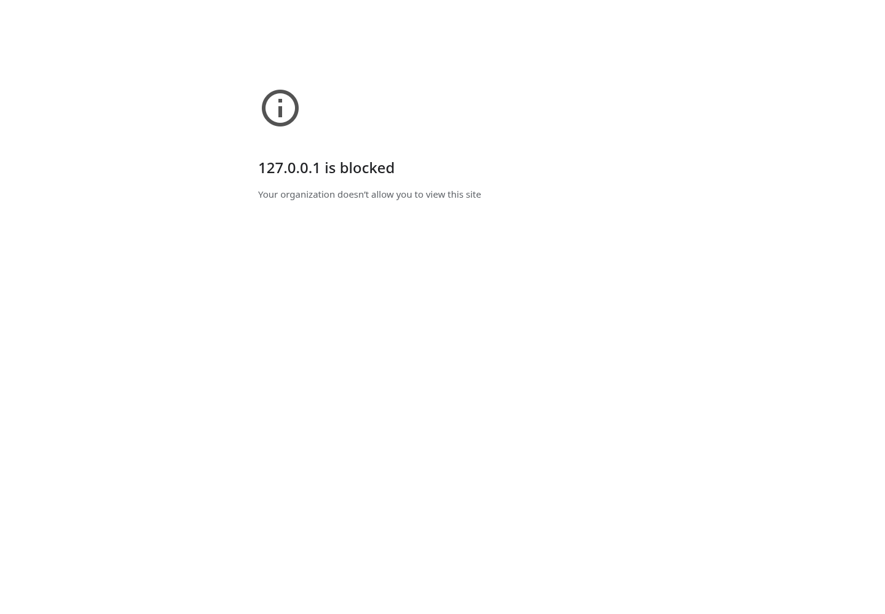

# Browser evidence, limitations and 35-scenario acceptance plan

**Read-only audit · October 5, 2026 · byronwall/explorEDA**  
**Revision:** `362db58082df9c1b57c2305a49823a1dae385081`  
**Fresh application browser tests:** 0 completed; navigation blocked by administrator policy.

## Result of the requested browser grounding

**Fresh application behavior: not verified.** An actual Chromium browser was available and real navigations were attempted. The browser never reached explorEDA. This report therefore contains environment observations, not a product walkthrough disguised as testing. All 35 proposed application scenarios are marked NOT EXECUTED in both the prose and machine-readable ledger.

The audit used Chromium **144.0.7559.96** through Playwright/CDP, at **1440 × 1000 CSS pixels**. The final recorded probes ran on October 5, 2026 at approximately **13:58 UTC**. The managed browser configuration blocks all URLs. No policy was disabled, removed or bypassed. The browser could be controlled, but application navigation was prohibited.

## Actual navigation attempts and evidence

| ID | Target | Actual result | App checks completed |
| --- | --- | --- | ---: |
| B01 | https://exploreda.dev/ | ERR_BLOCKED_BY_ADMINISTRATOR; organization block page | 0 |
| B02 | http://127.0.0.1:8765/ | ERR_BLOCKED_BY_ADMINISTRATOR; local address blocked | 0 |
| B03 | local deployed index.html through file URL | ERR_BLOCKED_BY_ADMINISTRATOR; file links blocked | 0 |

The JSON log contains target, timestamp, browser version, viewport, error text and captured block-page text. Each attempt has a screenshot. An early capture attempt encountered a destroyed execution context while the error page was committing; a short stabilization wait allowed the final captures above to complete. This was an evidence-capture timing issue, not an explorEDA runtime error.

A failed public navigation is **not evidence that the deployed site is down**. The local server was not a workaround that bypassed policy: it was also blocked, and testing stopped. A trivial set-content renderer probe used during diagnosis did not execute the app and contributes no application verification.

## Exact-build recovery and its limits

Read-only GitHub access successfully retrieved deployment run **37259962552** and artifact **11324128490**, `github-pages`, for the pinned revision. The run succeeded and the artifact was downloaded/extracted for local inspection. The archive and its hashes are retained in this package because the reported artifact retention was only about one day, expiring October 6 at 03:35:29 UTC. This preserves a usable target for a later authorized browser environment. [DEPLOY]

The main bundle and local datasets were present. No source maps were observed in the downloaded asset set. Static inspection cannot certify layout, user interaction, Canvas/WebGL behavior, downloads or accessibility. The successful deployment record likewise is not a successful browser deployment check.

The coverage matrix is deliberately omitted from this production build. A later production application test should not expect `?view=coverage` to work; use a development build or a separate generated coverage artifact for BT35. The remaining app examples and data are still useful targets for an authorized browser. [HOST]

## Independent checks actually completed

The deployed CSV files were parsed independently in Python. For shop operations, **167 of 500 rows have Channel=Web**. For Lorenz, **164 of 1,000 rows meet Time 0.2–1 and Z 10–30**, and **489 meet Z 10–30 alone**. Exact zero-based source positions and dataset hashes are included in `data/independent-data-oracles.json`.

These calculations corroborate the expected numbers in the historical review. They do **not** demonstrate that clicking a mark, removing a chip or restoring settings currently yields those rows in the application. Distinguish a correct dataset oracle from a correct UI-to-filter mapping. [REVIEW]

A six-row synthetic fixture is also included. Its eligible numeric values are 10, 20, 0 and -5, yielding sum 25 and average 6.25. Region A has 3 source rows but only 2 numeric contributors, sum 30 and average 15. Region B also has 3 source rows and 2 contributors, sum -5 and average -2.5. Its offset timestamp crosses from January 31 local time into February 1 UTC. These are designed acceptance oracles, not observed explorEDA results.

## Historical browser records: what can and cannot be credited

The October 2 repository review reports 37 specific feature/example checks in seven examples. It records Web selection/toggle, Lorenz filter removal, numeric-day labeling, shared facet ticks, table sorting/formatting, unmatched search, invalid calculation feedback and useful accessible names. It reports selected 1280/1024 layouts and limited 783/390 flows, without expanding the desktop minimum below 1024. It expressly does not cover virtual scrolling. These are **repository-authored historical claims**, not fresh observations by this audit. [REVIEW]

The report's screenshots are linked to tmp-root files that are absent from the pinned directory listing. The narrative remains available, and two numerical oracles can be independently reproduced from the deployment data, but the referenced browser images could not be inspected at their stated paths. Do not discard the historical record, and do not overstate its independently available evidence. [REVIEW] [TMP]

The September audit also records known-answer pivot, line, Tukey, grouped-summary and JSON restoration work. It says CSV browser download inspection did not complete and warns that large full-page facet captures lost paint. Those facts should survive any new summary. They are not refreshed by a later build. [BASE]

The October 4 chart closure reports passing Node 24 checks with 530 library and 21 demo tests, but no fresh browser run. Cross-view comparisons and browser restores were explicitly waived. The PR and chart guide correctly say they were not passed. This audit did not run the test suite and must not relabel its reported totals as local execution. [CLOSE] [CHART]

## How the next authorized test run should work

Pin both source and deployed build. Use the included small fixtures before the larger demos. Record the population boundary, source keys and eligible numeric keys before comparing numbers. Capture canonical settings before/after operations and compare full-analysis reopen against imported source rows, not a conveniently reloadable example alone.

Screenshots should show the selected mark and its trace simultaneously where possible. Pair them with exported keys/counts and settings, console/page errors, browser/version/viewport, dataset hashes and a trace or recording. A screenshot cannot prove a denominator; a unit reducer cannot prove a click selected the right mark. Use viewport captures for large facet states and explicitly test keyboard focus/return.

The supplied `browser/capture_review_targets.py` is a **navigation/evidence utility**, not a completed application regression suite. It can collect real pages in an authorized environment and refuses to reinterpret a blocked page as a pass. The following scenarios supply the missing human or automated behavioral work. They are proposed tests, not assertions that absent optional features should already pass.

## Acceptance scenarios — all NOT EXECUTED

### BT01 · First inspection loop

**Fixture:** analytical-edge-cases.json. **Requirements:** DATA-01 DATA-02 DASH-01.

**Procedure:** Import JSON; inspect fields; open Rows; create a distribution from value; return to the table.

**Oracle / question:** Six records remain available. Source names and inferred/effective types are visible. Opening Fields/inspectors does not silently replace saved layout. Header distributions are present by default.

**Status:** NOT EXECUTED: application navigation blocked.

### BT02 · Numeric eligibility and formatting

**Fixture:** analytical-edge-cases.json plus host nonfinite values. **Requirements:** DATA-02 TABLE-05 UX-01.

**Procedure:** Compare Summary, inline distribution, histogram, box, grouped average and Metric Card. Apply a value alias, USD and two decimals; inspect count units and exact thresholds.

**Oracle / question:** Base fixture eligible keys are r1,r2,r4,r6; sum 25, average 6.25. Blank and null are not zeros. Nonfinite and boolean additions are excluded as measurements. Count is not formatted as currency.

**Status:** NOT EXECUTED: application navigation blocked.

### BT03 · Local versus global filtering

**Fixture:** analytical-edge-cases.json. **Requirements:** FILT-01 FILT-02 FILT-04.

**Procedure:** Select region A in a chart. Add a table-local search, then Rows-local range. Compare global count, table counts and peer context; use Clear all.

**Oracle / question:** Global region A is 3 records; each local restriction affects only its declared table. Clear all returns the loaded six without retaining a hidden row restriction. Peer context is not misreported as global selection.

**Status:** NOT EXECUTED: application navigation blocked.

### BT04 · Exact and unbounded range

**Fixture:** analytical-edge-cases.json. **Requirements:** FILT-06 FILT-07.

**Procedure:** Use a numeric cell's at-or-above action. Inspect saved bound. Add a new row above the previous maximum in a controlled host fixture. Separately drag a brush to its edge.

**Oracle / question:** An omitted upper bound admits new higher eligible values; a finite brush bound remains finite unless explicitly converted. Exact thresholds survive rounding. Do not demand unbounded brush semantics unless that contract is implemented.

**Status:** NOT EXECUTED: application navigation blocked.

### BT05 · Typed values and Other

**Fixture:** typed-categories.json plus 60 named categories. **Requirements:** FILT-08 FACET-07.

**Procedure:** Select numeric 1, then string 1 and missing. Search and select a rare Other member; resize, change top ranks and restore settings.

**Oracle / question:** Selections retain actual typed values. Other is a presentation grouping, not a saved category literal. Selected rare membership survives rank and size changes.

**Status:** NOT EXECUTED: application navigation blocked.

### BT06 · Search scope and explanation

**Fixture:** analytical-edge-cases.json. **Requirements:** FILT-09 FILT-10.

**Procedure:** Hide text, search needle, search a calculated field, then clear. Check any match highlighting and search scope controls.

**Oracle / question:** Record which fields actually participate. A hidden-field match should be explainable. Missing scope/highlight features are observations to record, not assumed failing assertions of existing behavior.

**Status:** NOT EXECUTED: application navigation blocked.

### BT07 · Cross-view aggregate and contributor agreement

**Fixture:** analytical-edge-cases.json. **Requirements:** CALC-06 TRACE-01 UX-02.

**Procedure:** Create count/sum/average by region in grouped summary, bar, pivot, heatmap and card. Alt-open traces and compare source keys, eligible keys and values under the same explicitly recorded scope.

**Oracle / question:** A: 3 source rows, 2 numeric contributors, sum 30, average 15. B: 3 source rows, 2 contributors, sum -5, average -2.5. Distinguish global from own-filter-excluded peer populations.

**Status:** NOT EXECUTED: application navigation blocked.

### BT08 · UTC boundaries and rollups

**Fixture:** analytical-edge-cases.json. **Requirements:** FILT-11 SCALE-03 CHART-03.

**Procedure:** Compare Calendar days to monthly Line Chart summaries. Inspect r1; change week start; filter February and restore.

**Oracle / question:** r1 belongs to February 1 UTC, not January 31. Leap day is retained. February valid numeric values total 25 over 3 eligible records; invalid-date r5 is separately disclosed. Period upper bounds agree across filter and trace.

**Status:** NOT EXECUTED: application navigation blocked.

### BT09 · Empty versus invalid dates

**Fixture:** analytical-edge-cases.json plus empty month. **Requirements:** FILT-11 UX-02.

**Procedure:** Select an absent month, a period with records but invalid numeric values, and a valid zero day.

**Oracle / question:** The UI distinguishes no source rows, no eligible measurements and valid zero. Missing periods do not silently become observed zero or interpolate without disclosure.

**Status:** NOT EXECUTED: application navigation blocked.

### BT10 · Scale and bubble semantics

**Fixture:** analytical-edge-cases.json. **Requirements:** SCALE-01 SCALE-02 SCALE-03 CHART-02.

**Procedure:** Inspect linear/symlog axes and bubble size; filter peers, brush own chart, resize, and reopen settings. Record raw versus calendar line eligibility.

**Oracle / question:** Domain-population rules and area encoding are explicit. Zero size is not silently a positive measurement. True log is not offered as implemented through symlog. Own filtering does not accidentally redefine a promised full-source size scale.

**Status:** NOT EXECUTED: application navigation blocked.

### BT11 · Owner navigation and reset

**Fixture:** shop-operations and two same-field filters. **Requirements:** FILT-03 FILT-04 DASH-08.

**Procedure:** Activate several filters until the overflow popover appears. Click/focus chip labels, use Rows-mode chips, remove one X, and clear all.

**Oracle / question:** Labels reveal the correct owner without removing its filter; hover/focus highlights it. X removes only the intended predicate. Keyboard focus reaches the owner and escape returns appropriately.

**Status:** NOT EXECUTED: application navigation blocked.

### BT12 · Table controls and source-order recovery

**Fixture:** analytical-edge-cases.json. **Requirements:** TABLE-01 TABLE-02 TABLE-03 UX-03.

**Procedure:** Drag a header, use move/hide/show hidden, resize by pointer and keyboard, Reset width, sort twice then Clear sort; exercise keyboard context menu.

**Oracle / question:** Order, widths and visibility update the same saved table settings. Clear sort restores source order. Header click currently toggles asc/desc; absence of a third click is a preference distinction. Reset width is not content auto-fit.

**Status:** NOT EXECUTED: application navigation blocked.

### BT13 · Long text and rich-cell boundary

**Fixture:** analytical-edge-cases.json plus tag/image/history JSON. **Requirements:** TABLE-06 TABLE-07 TABLE-08 TABLE-12.

**Procedure:** Read/copy multiline text; import a tag array and related object. Inspect loss of structure and available cell-detail controls.

**Oracle / question:** Record scalar flattening explicitly. Confirm quoted/newline content is not corrupted in export. Rich rendering, editing and card view are not assumed supported merely because JSON import succeeds.

**Status:** NOT EXECUTED: application navigation blocked.

### BT14 · Grouped, stacked and percentage bars / areas

**Fixture:** positive variant values 10,20,5,0,missing. **Requirements:** CHART-01 CHART-08 TRACE-03.

**Procedure:** Inspect category-series pairs, stack bounds and percentage denominators. Add a negative measurement and an all-invalid group. Switch to UTC area/stacked area with an absent period.

**Oracle / question:** Stack absolute data before pixel scaling; positive group 10+20 has total 30 and shares one-third/two-thirds. Reject or explicitly exclude invalid stack inputs by contract. Do not stack averages or bridge absent observations silently.

**Status:** NOT EXECUTED: application navigation blocked.

### BT15 · Density-bin membership

**Fixture:** boundary points plus duplicate coordinates. **Requirements:** CHART-02 TRACE-01.

**Procedure:** Create rectangular density, click a boundary bin, Alt-inspect it, brush and resize. Compare source IDs with independent interval predicates.

**Oracle / question:** Each eligible point belongs to the intended bin exactly once, including maximum edges. Bin counts and traces agree; bounds are defined in data units. Rectangular counts are not claimed as KDE or hex bins.

**Status:** NOT EXECUTED: application navigation blocked.

### BT16 · Box, violin and beeswarm contributors

**Fixture:** values 1,2,3,4,100 plus blank. **Requirements:** CHART-04 TRACE-01.

**Procedure:** Inspect the box trace and outlier, compare displayed source IDs, scale values by 100000 and compare beeswarm screen distances.

**Oracle / question:** The five eligible observations are retained; observed Tukey whiskers and 100 outlier follow the documented rule. Density inputs and exclusions are inspectable. Screen-space collision behavior remains legible under unit changes.

**Status:** NOT EXECUTED: application navigation blocked.

### BT17 · Facet comparison and navigation

**Fixture:** typed categories with empty and very different ranges. **Requirements:** FACET-01 FACET-02 FACET-03 FACET-04 FACET-05 FACET-06.

**Procedure:** Compare full-source ticks; change fields; reorder visible facets; page and Focus; select headers and brush. Resize to 1024.

**Oracle / question:** Typed groups retain identity, domains follow current fields, labels are not cut off and visibility is not a row filter. Existing global XY selection remains distinct from unimplemented facet-local selection.

**Status:** NOT EXECUTED: application navigation blocked.

### BT18 · Calculation edit and failure atomicity

**Fixture:** analytical-edge-cases.json. **Requirements:** CALC-01 CALC-02 CALC-03 CALC-04 CALC-05 CALC-11.

**Procedure:** Add net=value*2 and margin=net-1; filter net>=20; preview an edit; Apply; attempt a cycle, unknown field and invalid function. Inspect dependencies and export.

**Oracle / question:** On the base fixture net>=20 selects r1,r2. A valid edit recomputes dependent consumers while retaining intended thresholds. Invalid edits never replace the saved analysis. Inputs, eligible failures and dependency paths remain inspectable.

**Status:** NOT EXECUTED: application navigation blocked.

### BT19 · Reusable grouped result

**Fixture:** analytical-edge-cases.json. **Requirements:** DATA-08 CALC-07 CALC-08 PERF-02.

**Procedure:** Create one named region sum used by a bar and table; edit once; filter peers; inspect all contributors; attempt referenced deletion.

**Oracle / question:** Both consumers reference the same definition and return the correct scoped result. Dangling references are rejected. Measure whether execution is reused; do not infer caching from equal numbers.

**Status:** NOT EXECUTED: application navigation blocked.

### BT20 · Shared color and legend behavior

**Fixture:** typed-categories.json plus numeric color field. **Requirements:** COLOR-01 COLOR-02 COLOR-03.

**Procedure:** Bind the same shared color scale in multiple views; rename and edit categories; inspect automatic/dedicated legends; restore.

**Oracle / question:** Typed categories and colors stay aligned across views. Record which legends really filter and which only display values. All non-obvious size/density/color encodings have an explanation in their supported scope.

**Status:** NOT EXECUTED: application navigation blocked.

### BT21 · CSV download roundtrip

**Fixture:** analytical-edge-cases.json. **Requirements:** TABLE-10 TABLE-11.

**Procedure:** Sort, hide/reorder columns, apply search/filter and a calculated column; download CSV; parse the actual downloaded bytes.

**Oracle / question:** Exported keys, row order, selected fields and derived values match the table scope. Quotes, commas, tabs and newlines are escaped without changing data. Browser download completion is recorded separately from unit helper success.

**Status:** NOT EXECUTED: application navigation blocked.

### BT22 · Settings and full-analysis restore

**Fixture:** analytical-edge-cases.json plus mixed current chart modes. **Requirements:** DASH-03 DASH-04 DASH-05 DASH-06.

**Procedure:** Edit formulas, filters, order, widths, layout and field formats. Export settings and full bundle; remount/reopen; submit invalid JSON and invalid dependencies.

**Oracle / question:** Full bundle restores source values and applied state. Settings-only restores against supplied host rows. Compare canonical state excluding snapshot timestamp; errors leave current analysis intact. Draft persistence and durable named saves are not implied.

**Status:** NOT EXECUTED: application navigation blocked.

### BT23 · Source identity boundary

**Fixture:** same records in a new order. **Requirements:** DATA-04 TABLE-09 CALC-10 TRACE-05.

**Procedure:** Trace/select r1; save; reorder host rows; restore settings and then full analysis; compare stable key versus positional __ID.

**Oracle / question:** Record positional identity limitations and avoid false stable-key claims. A future identity contract must reject mismatched source fingerprints or remap through declared keys rather than silently choose another record.

**Status:** NOT EXECUTED: application navigation blocked.

### BT24 · Trace activation and accessibility

**Fixture:** each delivered mark family. **Requirements:** TRACE-01 TRACE-03 UX-03.

**Procedure:** Use normal click/Enter, Alt-click/Alt-Enter and header trace; navigate contributors and close; test keyboard and a real screen reader.

**Oracle / question:** Normal activation follows selection contract; trace action inspects the intended mark without silently changing selection. Names, focus order, selected mark context and focus return are meaningful; names alone are not a pass.

**Status:** NOT EXECUTED: application navigation blocked.

### BT25 · Historical oracle replay

**Fixture:** deployed shop-operations and lorenz_3d_small. **Requirements:** FILT-02 FILT-04.

**Procedure:** Open shop, select Web and toggle off. Open Lorenz preset; remove Time but keep Z.

**Oracle / question:** Shop Web=167/500 then 500/500. Lorenz both ranges=164/1000; Z alone=489. Independent CSV oracle is included; actual UI interaction remains to be executed.

**Status:** NOT EXECUTED: application navigation blocked.

### BT26 · General transform boundary

**Fixture:** one explicit pivot-as-source or model consumer task. **Requirements:** DATA-08 CALC-08 TRACE-02 TRACE-04 TRACE-05 TRACE-06.

**Procedure:** Attempt to reuse a pivot/density/model result as a named source through documented public controls; inspect available configuration and transform outputs.

**Oracle / question:** Distinguish actual capability, rejected operation and absent UI. A trace table does not prove a composable transform source. Use the failed task to define a bounded future design, not a universal graph rewrite.

**Status:** NOT EXECUTED: application navigation blocked.

### BT27 · Planned-only scatter and DSL scope

**Fixture:** PR136 intent versus shipped build. **Requirements:** CALC-09 CHART-02 TRACE-04 TRACE-06.

**Procedure:** Check available public controls for regression, LOESS, hexagons, marginals, contours and compact document authoring; compare to plans.

**Oracle / question:** At this revision PR136 makes no application changes. Do not award implementation/review coverage for its plans. When implemented, fit scope must explicitly distinguish own versus peer filters.

**Status:** NOT EXECUTED: application navigation blocked.

### BT28 · Parallel Coordinates, ECDF and 3D boundaries

**Fixture:** typed numeric/category fixture with ties and missing values. **Requirements:** CHART-06 CHART-09.

**Procedure:** Reorder/invert parallel axes, intersect two ranges, inspect excluded incomplete rows; verify ECDF both directions and ties; drive 3D from 2D.

**Oracle / question:** Parallel selections remain in data units. For ECDF values 1,1,2, at-or-below 1=2/3 and at-or-above 1=1. 3D receiving a filter is not proof of 3D point selection.

**Status:** NOT EXECUTED: application navigation blocked.

### BT29 · Map joins and saved geometry

**Fixture:** typed region keys and coordinate edge cases. **Requirements:** DATA-05 CHART-10 DASH-03.

**Procedure:** Test point coordinates, invalid rows, duplicate region features, unmatched typed keys, pan/reset, selection, source trace and full-analysis reopen.

**Oracle / question:** Invalid coordinates are disclosed; number/text region keys do not merge. Duplicate features follow declared region identity. Geometry assets and selections survive restore; maps use local geometry rather than requiring external tiles.

**Status:** NOT EXECUTED: application navigation blocked.

### BT30 · Source grain and relationships

**Fixture:** file records linked to event records. **Requirements:** DATA-05 TABLE-07.

**Procedure:** Try the documented source interface using one file with several events and a file-level cost.

**Oracle / question:** Do not count duplicated file-level cost once per event without a declared grain decision. Region geometry joins do not establish relational analytical source support.

**Status:** NOT EXECUTED: application navigation blocked.

### BT31 · Loading, cancellation and available population

**Fixture:** whole-file local input and controlled slow example host. **Requirements:** DATA-06 DATA-07 FILT-05 PERF-03 PERF-04.

**Procedure:** Start and replace example requests, induce an error and retry; test a large local import while measuring responsiveness.

**Oracle / question:** Stale fetches do not overwrite new input. Report actual loading progress and cancellation boundaries. Do not imply streaming/remote projection or total available count without a protocol.

**Status:** NOT EXECUTED: application navigation blocked.

### BT32 · Expected observations and hierarchy semantics

**Fixture:** expected A/B by three dates, one absent combination. **Requirements:** DATA-09 CHART-09.

**Procedure:** Compare null cell detection with missing record detection. Inspect any hierarchy or heatmap claims against the expected grid.

**Oracle / question:** The six expected observations and five actual records imply one absent observation even with no null cells. A generic heatmap or map join does not supply that expectation model.

**Status:** NOT EXECUTED: application navigation blocked.

### BT33 · Saved cohort and frozen baseline boundary

**Fixture:** analytical-edge-cases.json with a saved region subset. **Requirements:** DASH-06 TABLE-09 CHART-07.

**Procedure:** Save a subset, alter underlying data and compare the Metric Card all-source reference/ECDF overall curve to a frozen cohort expectation.

**Oracle / question:** All-source comparison may change with the source; it is not a versioned baseline. Named saved cohorts, stable membership and undo remain distinct capabilities.

**Status:** NOT EXECUTED: application navigation blocked.

### BT34 · Desktop, virtualization and performance

**Fixture:** existing 500 and 10000 row examples, then controlled row/column/facet sweeps. **Requirements:** PERF-01 PERF-02 PERF-05 UX-03 UX-04.

**Procedure:** Measure load/filter/Apply/scroll and heap at 1280 and 1024; record hardware/browser; inspect long labels, menus, virtual row semantics and keyboard access.

**Oracle / question:** Report measured distributions and device conditions, not an arbitrary universal row limit. No page-level overflow or inaccessible critical control at supported widths. Optional narrow probes do not expand support policy.

**Status:** NOT EXECUTED: application navigation blocked.

### BT35 · Coverage proof integrity

**Fixture:** development build plus manifest and review artifacts. **Requirements:** TRACE-07.

**Procedure:** Open ?view=coverage in a dev build; compare summary to the included counts; follow each report/artifact; alter a source fingerprint in an isolated test of future validation.

**Oracle / question:** Expected catalogue counts are 52/51/30/22 as defined in the report. Every reviewed assignment should resolve to dated, revision-bound proof. Production omission of the matrix is intentional, not a failed dev-route check.

**Status:** NOT EXECUTED: application navigation blocked.

## Reporting rules for the follow-up

Report observed failures with reproducible steps and exact expected/actual values. Report absent proposed capabilities as unsupported or out of scope, not as broken implemented behavior. Keep environment-blocked, not-run and waived distinct. A later successful run can add proof without rewriting the historical fact that this audit was blocked.

No screen-reader certification, mobile support certification, performance capacity claim, production availability conclusion or full chart-combination correctness claim can be made from this audit's browser evidence.

---

Source labels link to the identified repository files or PR/run records. Full source locators and reading scope are in Report 06.

[BASE]: https://github.com/byronwall/explorEDA/blob/362db58082df9c1b57c2305a49823a1dae385081/docs/transcript-gap-analysis.md "Original transcript reconciliation; mixed-age September baseline with later edits"
[CHART]: https://github.com/byronwall/explorEDA/blob/362db58082df9c1b57c2305a49823a1dae385081/docs/analytical-chart-coverage.md "Current chart contracts, boundaries, and verification waiver"
[CLOSE]: https://github.com/byronwall/explorEDA/pull/135 "Merged documentation-only closure; waived cross-view comparisons and browser restores; metadata read"
[DEPLOY]: https://github.com/byronwall/explorEDA/actions/runs/37259962552 "Successful deploy and downloadable github-pages artifact 11324128490; metadata and archive inspected"
[HOST]: https://github.com/byronwall/explorEDA/blob/362db58082df9c1b57c2305a49823a1dae385081/apps/demo/src/LandingPage.tsx "Development-only matrix gate; host import, restore, state capture"
[REVIEW]: https://github.com/byronwall/explorEDA/blob/362db58082df9c1b57c2305a49823a1dae385081/docs/reviews/2026-10-02-example-coverage.md "Repository-authored historical browser review of 37 assignments in 7 examples"
[TMP]: https://github.com/byronwall/explorEDA/tree/362db58082df9c1b57c2305a49823a1dae385081/tmp "Pinned directory listing contains only evals/; October 2 report screenshots at tmp root absent"
