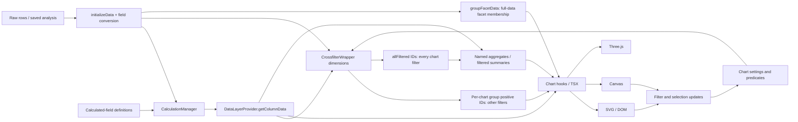
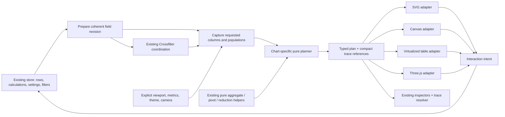

# Implementation plan: deterministic rendering and data traceability

## 1. Executive decision

Adopt **chart-specific deterministic planners with a small shared plan/trace envelope**, reached through individual chart extractions. Keep Crossfilter, CalculationManager, existing aggregation functions, React, D3 and Three.js. The new boundary accepts a coherent prepared-value snapshot, named ID populations, existing settings and explicit layout inputs. It returns materialized marks or logical cells plus lineage references. Drawing code must not query the store, evaluate formulas, select populations or recompute aggregate values.

The first production slice is **scatter points**, retaining the existing Canvas adapter and SVG BaseChart shell. A completed point plan can be inspected without reverse-engineering Canvas pixels. Extract guides, labels and color resolution next; do not claim that a point-only phase delivers complete chart-object provenance.

**Overall status: PARTIAL; repository mutation: NO-GO.** The attached patch is an investigation/prototype patch, not a production chart migration. Source inspection and isolated planner tests support the direction. The real Crossfilter integration test, all eleven chart dispositions, D3 parity, Three.js/table adapter coverage and full-workspace measurements remain mandatory implementation gates. No public API or saved-data change is authorized by this plan.

## 2. Access evidence and checks actually performed

| Item | Evidence |
|---|---|
| Exact repository | `https://github.com/byronwall/explorEDA`, owner `byronwall`, repository `explorEDA`; metadata read through the connected GitHub action |
| Selected remote branch | `main` |
| Base commit | `593ca2e1f9210d5bc66985437afc37fcfcd8a56a`; matches the prepared ref in the request |
| Requested work branch | `codex/deterministic-rendering-data-traceability`; **not created in this session** |
| Clone path | No clone. Local fallback artifacts: `/mnt/data/exploreda-investigation/deliverables/` |
| Current local branch / `git status --short` | Not applicable: no checkout or `.git` directory was created |
| Git transport check | `git ls-remote` failed: `Could not resolve host: github.com` |
| Push capability | Account metadata permits push, but the active runtime has no working authenticated Git transport and the connected actions expose reads, not branch pushes |
| Changes preserved | No existing repository checkout or working-tree edits were touched; earlier standalone HTML artifacts were not modified |
| Actual isolated validation | TypeScript 5.8.3 strict compilation of two new pure modules; 12 standalone Node assertion groups; benchmark and SVG serialization; see findings |
| Repository validation | `pnpm check`, package tests, check-types and build could not launch: `pnpm` is absent; no repository baseline failure is inferred |
| Commit / push / pull request | None created or attempted as a write. No commit identities were set because no commit was made |

[Architecture options](architecture-options.md#appendix-repository-evidence-and-reading-inventory) lists the 68 source files/documents inspected and the relevant symbols. The required route was followed, with `useGetLiveData.tsx` and `useGetColumnData.tsx` found under `components/charts/`, not the prompt's `hooks/` paths. ThreeDScatter's implementation is `ThreeDScatterChart.tsx` and its data hook, not a same-name TSX file. These are verified path corrections, not missing functionality.

The fallback follows the prompt: full Markdown documents, bounded prototype source/tests and an applicable new-file patch. A later operator must verify the remote base again, create the exact branch, run repository validation, inspect the staged diff, verify author and committer `Byron Wall <byron@byroni.us>`, and push only that branch. A newer main requires rechecking changed evidence; do not apply this plan as though it had inspected future commits.

## 3. Product principles and scope

The prior conversation contributes: bidirectional provenance, separate value/control influence, explicit cardinality changes, materialized intermediate values, inspectable scales and guide glyphs, editable parameters, deterministic scene descriptions and dense-but-bounded inspection. The repository transcripts reinforce explicit filter/facet boundaries and the separation of default chart behavior from an arbitrary transform engine. [Traceability][trace-intent], [templating][template-intent], [specs][spec-intent], [transforms][transform-intent], [grouping][group-intent], [source scope][source-intent].

This repository work does **not** port the previous HTML graph UI. Reuse the existing calculation trace, aggregate inspector, pivot contributor inspector and temporary chart-data preview. UI integration should preserve focus return, keyboard access, soft theme tokens and compact temporary inspection. [CalculationTrace][calc-trace], [GroupedAggregateInspector][aggregate-inspector], [PivotTable][pivot], [UI defaults][ui].

No multisource join, SQL lineage, execution server, persisted DAG, plugin architecture or general visual grammar is needed for the first migration. Fixed inputs get a parameter reference. A source namespace avoids future ID collisions but does not promise a multiple-table execution system. Before/after visualization is not a success criterion.

## 4. Current-state dataflow and pain points



**Observed source paths** are detailed in the options document: scatter, grouped bar, faceted scatter, reduced line and 3D scatter. The main problems are not an absence of math helpers. They are population ambiguity, lazy store access inside computations, identity loss through parallel arrays/reduction, adapter-owned domains/layout, and inconsistent inclusion of facet/own filters. [state][state], [live hooks][live], [bar][bar], [line][line], [3D data][3d-data].

Do not discard these assets: `calculateGroupedAggregate`, `numericInputs`, `calculatePivotData`, `calculateBoxPlotStats`, `calculateKernelDensity`, seeded `calculateBeeSwarmPositions`, `reduceDataPoints`, `categoryKey`, `CalculationManager` and its errors. The migration wraps or incrementally extends them with identities; it does not implement a parallel math stack. [aggregate][aggregate], [pivot math][pivot-math], [box math][box-math], [reduction][reduction], [categories][categories], [calculation][calculation].

### The filter populations are not interchangeable

| Population | Current consumers / behavior |
|---|---|
| Full prepared source IDs | Scalar calculations; many numeric scale domains; full category order; facet membership. |
| Positive entries of a chart's own Crossfilter group | Other-chart filters apply; its own dimension is exempt. Scatter and categorical chart components can keep their own unselected items visible. The wrapper comments explicitly require checking own filters again where needed. |
| `getFilteredRowIds()` | Every active chart dimension applies. Used by named aggregates and filtered SummaryTable. |
| Chart-group IDs intersected with facet IDs | Common child-chart draw population; not a new independent chart dimension. Empty-array and unsupported-family exceptions exist. |
| DataTable local search / Rows settings | Additional local restrictions, not automatically a global Crossfilter predicate. DataTable also reapplies its own filters. |

Source evidence: [CrossfilterWrapper methods][crossfilter], [DataLayerProvider.getAggregateResult][state], [getFilteredRows][table-filter], [data-table definition][table-definition], [SummaryTable][summary], [FacetContainer][facets]. Per-chart group self-exemption is the expected dependency behavior of the inspected wrapper, not a newly executed Crossfilter result in this environment.

## 5. Options checkpoint and selected boundary

[architecture-options.md](architecture-options.md#4-consider-and-contrast-checkpoint) compares:

- **A:** independent pure view models while leaving some layout/guide logic in adapters;
- **B:** chart-specific planners, explicit snapshots, typed plan variants and shared provenance;
- **C:** a full declarative grammar/operator graph.

B is selected, implemented through A-sized slices. C exceeds scope. A alone does not establish one consistent inspection boundary for guide text, Canvas points, logical cells and 3D points. Scores are domain-specific, non-averaged and explicitly distinguish assumptions from observed source behavior. Actual repository timing remains unmeasured rather than assigned a fictitious score.

The isolated experiment supports copying Crossfilter outputs before planning and referencing populations instead of copying them into each point. It also exposes that verbose string bindings can dominate serialized plan size. The target should share layer-level field/style bindings; it must not simply scale up the prototype's per-point debug objects.

## 6. Target architecture for both tracks



**Source/field preparation** owns conversion and calculation execution. Initially force only the requested columns and their dependencies through existing getters, then seal/copy the necessary values. Do not read a cache from one revision and filter IDs from the next. Display formatting should not rerun numeric calculations. Conversion edits preserve the provider's current filter-clearing behavior unless a separate change is approved. [DataLayerProvider][state], [field settings][conversion].

**Coordination** owns the mutable Crossfilter instance. It resolves current chart predicates using the same registry definitions, copies group membership and all-filter IDs, and publishes a coherent token. The pure planner never receives Crossfilter, a Zustand getter, React hook or a closure over mutable columns.

**Planning** owns facet/series/group outputs, transform identities, aggregate consumption, sample selection, domain policy, logical geometry and inclusion diagnostics. It may call D3 pure math helpers. D3 scale instances are temporary calculation objects, not serialized plan values. The result contains their resolved domain/range/type/parameters and any generated path commands.

**Drawing** owns DOM nodes, React reconciliation, Canvas contexts, DPR backing buffers, WebGL objects/shaders, resource disposal, camera controls and hit testing. It may consume recorded geometry and styles, but may not pick a new data population. A target may implement only compatible payload kinds; “one boundary” does not mean a Canvas adapter must draw a virtualized HTML table.

**Interaction** keeps existing semantics. A mark click may request inspection, toggle a category or emit a domain brush depending on the chart. Use stable mark identity to retrieve an intent descriptor; do not infer source IDs from DOM order, path shape or pixel color. Orbit controls emit numeric camera updates through the existing persistence path. Keyboard selection must reach the same identity as pointer selection.

## 7. TypeScript contract sketches

These are target sketches, not a new published API. The retained scatter prototype intentionally implements a smaller subset. New branded types or generic executors are not required for the first slice.

```ts
type RowId = number; // Current IdType: zero-based index within a dataset epoch.
type RowSetId = string;
type TraceId = string;
type MarkId = string;
type FieldId = string;
type Scalar = string | number | boolean | null | undefined;

type Revision = Readonly<{
  datasetEpoch: string;
  values: number;       // Rows, conversion settings, or calculation graph/value changes.
  filters: number;      // Effective global/per-chart predicate changes.
  settings: number;     // This chart's specification changes.
  colors: number;       // Resolved color mappings and relevant theme values.
}>;

type OrderedRowSet = Readonly<{
  id: RowSetId;
  ids: readonly RowId[]; // Owned snapshot; readonly is not a runtime alias guarantee.
  basis: "all-prepared" | "other-filters" | "all-filters" | "facet" | "group" | "sample";
  parent?: RowSetId;
}>;

type PreparedColumn = Readonly<{
  field: FieldId;
  valuesById: Readonly<Record<RowId, Scalar>>;
  lineage: TraceId; // Source field, conversion recipe, or existing calculation definition.
}>;

type ChartInputs<S> = Readonly<{
  revision: Revision;
  settings: S; // Existing semantic settings normalized to plain data; Three vectors become tuples.
  columns: Readonly<Record<FieldId, PreparedColumn>>;
  rowSets: Readonly<Record<RowSetId, OrderedRowSet>>;
  populations: {
    all: RowSetId;
    othersPass: RowSetId;
    allPass: RowSetId;
    facet?: RowSetId; // Absent=unrestricted; present empty set=empty.
  };
  environment: {
    width: number; height: number;
    locale: string; timeZone: string;
    themeRevision: string;
    textMetricsRevision?: string;
    textWidths?: Readonly<Record<string, number>>;
    seed?: number;
  };
}>;

type ScalePlan = Readonly<{
  id: string;
  field?: FieldId;
  kind: "linear" | "symlog" | "band" | "ordinal-color" | "sequential-color";
  domain: readonly Scalar[];
  range: readonly (number | string)[];
  population?: RowSetId;
  fixedInput?: TraceId;
  parameters: Readonly<Record<string, number | string | boolean>>;
  lineage: TraceId;
}>;

type ValueRef = { kind: "row"; rowId: RowId } | { kind: "derived"; traceId: TraceId };
type MarkBase = Readonly<{
  id: MarkId;
  valueRef?: ValueRef;
  bindingRef: string; // Shared field/scale/style bindings per layer.
  a11yLabel: string;
  interactionRef?: string;
}>;

type Mark2D = MarkBase & (
  | { kind: "point"; x: number; y: number; radius: number }
  | { kind: "rect"; x: number; y: number; width: number; height: number }
  | { kind: "path"; commands: readonly PathCommand[]; vertexSources?: readonly ValueRef[] }
  | { kind: "text"; text: string; x: number; y: number; anchor: "start" | "middle" | "end"; rotation: number; fontRef: string }
);
type PathCommand =
  | readonly ["M" | "L", number, number]
  | readonly ["C", number, number, number, number, number, number]
  | readonly ["Z"];

type ChannelBindings = Readonly<{
  channels: readonly {
    channel: "x" | "y" | "z" | "color" | "size" | "opacity" | "text" | "stroke" | "width" | "height";
    field?: FieldId; scaleId?: string; fixed?: Scalar; traceRef?: TraceId;
  }[];
}>;

type PlanBase = Readonly<{
  chartId: string;
  revision: Revision;
  width: number; height: number;
  scales: readonly ScalePlan[];
  trace: TraceStore;
  bindings: Readonly<Record<string, ChannelBindings>>;
  diagnostics: readonly Diagnostic[];
}>;

type RenderPlan = PlanBase & (
  | { kind: "cartesian"; marks: readonly Mark2D[]; clip: readonly [number, number, number, number] }
  | { kind: "table"; orderedRowSet: RowSetId; columns: readonly FieldId[]; cells: readonly PlannedCell[]; window: readonly [number, number] }
  | { kind: "world3d"; points: readonly PlannedPoint3D[]; camera: CameraDescription; pointStyleRef: string }
  | { kind: "fixed-content"; content: string; contentFormat: "existing-editor-html"; valueRef: TraceId }
);

type PlannedCell = { id: MarkId; row: RowId | string; field: FieldId; text: string; valueRef: ValueRef; status: string };
type PlannedPoint3D = { id: MarkId; rowId: RowId; x: number; y: number; z: number; size: number; color: string; valueRef: ValueRef };
type CameraDescription = { position: readonly [number,number,number]; target: readonly [number,number,number]; fov: number; near: number; far: number };
type Diagnostic = { id: string; code: string; message: string; stage: string; rowSet?: RowSetId; field?: FieldId };

type TraceStore = Readonly<{
  records: Readonly<Record<TraceId, TraceRecord>>;
  rowSets: Readonly<Record<RowSetId, OrderedRowSet>>;
  exclusions: Readonly<Record<string, readonly { rowId: RowId; reason: string }[]>>;
}>;
type TraceRecord =
  | { kind: "field"; field: FieldId; stage: "raw" | "prepared" | "calculated"; recipe?: string; inputs: readonly TraceId[] }
  | { kind: "aggregate"; resultKey: string; contributorSet: RowSetId; includedSet: RowSetId; exclusionsRef: string; inputs: readonly TraceId[] }
  | { kind: "scale"; population?: RowSetId; inputs: readonly TraceId[] }
  | { kind: "reduction"; retainedSet: RowSetId; bucketSet: RowSetId; method: string; seed?: number; inputs: readonly TraceId[] }
  | { kind: "fixed"; parameter: string; value: Scalar };

type InteractionIntent =
  | { type: "inspect"; chartId: string; markId: MarkId; revision: Revision }
  | { type: "brush"; chartId: string; field: FieldId; min?: number; max?: number }
  | { type: "toggle-category"; chartId: string; field: FieldId; value: Scalar }
  | { type: "camera"; chartId: string; camera: CameraDescription };
```

A direct mark carries a row reference; its shared binding record identifies the fields and scales. A derived mark instead references an aggregate or transform result. This avoids repeating a full field/control descriptor on each point. A table's logical group-row key must not be coerced into a source `RowId`; pivot rows are derived identities. These are concrete inspection references, not a generic executable expression language.

Do not make all transforms understand camera or GPU buffer details. Camera and perspective point-sprite policy belong only to the 3D view payload and its adapter. Do not force rich-editor HTML through arbitrary SVG text layout: preserve that current editing component as fixed-content provenance, with byte-stable content but environment-dependent layout. No new HTML sanitization policy is silently implied by this plan.

## 8. Crossfilter semantics and deterministic integration

### Snapshot contract

Capture, in this order, within one synchronous state revision: (1) relevant converted/calculated columns; (2) effective predicates updated through the existing wrapper; (3) copies of positive chart-group IDs and all-filter IDs; (4) full and facet membership; (5) settings, color decisions and viewport inputs. A snapshot capture must not dispatch a setting change or schedule a formula update. If revision tokens differ before and after capture, discard it and recapture; never combine two revisions.

The planner consumes **resolved ordered ID sets**, not a query interface and not a declarative filter snapshot it must execute itself. Retain a compact filter description/revision for inspection. Detailed reasons can lazily evaluate the same pure registry predicates against frozen prepared columns, but that explanation path may not determine the draw set or consult a live store. Preserve the difference between “excluded by another dimension,” “outside this facet,” “invalid coordinate,” and “own filter not selected but still drawn.” [wrapper][crossfilter], [definitions][registry], [applyFilter][filter].

`allPass` is a subset of `othersPass` for a registered chart at a coherent revision. For ordinary scatter with supported x/y filters, membership in that intersection determines selected-versus-dimmed marks. For named aggregate bars, the computation consumes `allPass`. For line and pivot, own filters do not generally remove their own marks. DataTable re-applies its own predicates and local search; its `globalSearch` is not a Crossfilter-wide filter. SummaryTable is fully filtered. [scatter][scatter], [line][line], [pivot][pivot], [table-filter][table-filter], [summary][summary].

### Ordering and invalidation

Preserve separate ordering rules: original prepared row order, Crossfilter group-entry order, facet first-occurrence order, current typed category ordering, stable line x/tie order and table sort order. Copy them rather than inventing a universal sort. A cache key must include dataset epoch, value/calculation/conversion revision, effective filter revision, facet key/membership, settings, relevant color mapping, viewport and text-metric revision. A callable getter's identity is not an invalidation key.

Initially keep only the latest plan per active chart/facet viewport and the latest prepared-value revision. Dispose on chart removal and source replacement. No unbounded historical-plan cache or before/after snapshots are needed. Do not use `getAllData`'s incrementing read nonce as a durable content identity: it changes on reads and does not describe why the content changed. [wrapper nonce][crossfilter], [provider refresh][state].

Source replacement creates a new epoch because existing `__ID` values are positional. A formula edit retains source identities but changes the value revision, and active derived filters must be updated before capture. Display precision changes affect formatting/text but must not change numerical aggregates. The current conversion-edit policy clears affected direct field filters; characterize rather than override it. [initializeData][rows], [updateFieldSettings][state], [analysis reliability tests][reliability-test].

### Rejectable invariants

| Test | Required assertion |
|---|---|
| Own-filter exemption | With two chart dimensions, the inspected chart retains rows excluded only by its own brush; changing the other chart removes them. `allPass` still includes both filters. |
| Captured alias isolation | Update wrapper filters after capture; old row sets and plan remain unchanged. A fresh capture changes only expected scopes and marks. |
| Active calculated field | Edit `double = x*2` to `x` under `double >= 4`; prepared values, `allPass`, table and marks agree at one revision. Reuse reliability fixture. |
| Facet containment | Every migrated mark's value row belongs to the explicit facet. Full domains may reference rows outside it. Test absent versus empty facet separately; unsupported legacy cases remain off. |
| Stable order | Same inputs repeat; tied x values preserve source order; changing insertion/filter order cannot accidentally reorder equal categories beyond the preserved baseline policy. |
| Full versus selected domains | A filtered-out extreme still contributes to full-data scatter domains; aggregate domains follow current aggregate population as they do today. |
| Predicate equivalence | Typed `1` differs from `"1"`; missing categories remain typed; range endpoints are inclusive; pivot alternatives combine OR within field / AND across fields. |
| Restore | The first plan after saved-analysis restore matches current raw data and restored settings/calculations; no old epoch or half-restored palette leaks through. |

These tests augment rather than replace existing wrapper, aggregate, pivot and calculation tests. The fallback contains one actual-wrapper Vitest test, but it is **not executed here**.

## 9. Lineage model and a concrete trace

### Small composable representation

Use immediate references and shared row sets, not transitive copies of source records. Every reference is valid only for the retained dataset/value revision. IDs are semantic: source epoch + `__ID`; field name + preparation stage; chart ID + facet key + series key + mark role + source/group identity. Use existing `categoryKey` values for typed grouping; labels and array positions are not identities. [categories][categories], [aggregate group keys][aggregate], [facet keys][facets].

| Stage | Required evidence and storage policy |
|---|---|
| Source field | Dataset epoch, row ID, field; raw value looked up in the retained source revision. |
| Conversion/null handling | Field-settings recipe and source-field ref; lazily expose raw/prepared values and existing conversion failure reason. Do not store all preview example tables per mark. |
| Scalar calculation | Existing expression, dependency names/version and per-row result/error. Resolve dependency fields on the same row through CalculationManager-compatible metadata; no verbose AST execution log by default. |
| Filters | Captured population refs and effective predicate IDs. Store reasons for inspected exclusions or compact per-predicate excluded ID sets, not a copied whole row for each failed filter. |
| Facet/group/series | Typed key and member row-set reference. One-to-many series expansion adds series/field identity, not a new fabricated source row. |
| Aggregate | Reference the existing aggregate/pivot result. Reuse contributors, raw input, prepared input, inclusion and reasons. Group membership and numeric inclusion are distinct. |
| Reduction/sampling | Retained source IDs, excluded/not-represented IDs or a bucket-membership reference, exact method/budget/seed. A selected representative's value lineage is its own row; selection influence is the candidate bucket. |
| Scale/color | Domain policy, domain/range/parameters, population ref or persisted fixed mapping. Treat competing-domain rows as control influence, not value contributors to every point. |
| Glyph/cell/path/3D point | Stable mark identity, direct row or derived-result reference, shared channel bindings. Paths retain ordered vertex references and gaps. GPU instance index maps to the same identity. |
| Fixed values | Named parameter/theme/source-of-environment reference. Titles and constants may legitimately have zero source-row contributors. |

“Contributes” is conservative provenance, not a derivative/sensitivity claim. Every population member may be inspected even if a small change would not alter a minimum, maximum or median. Winner/bracket IDs can be additional detail; do not discard the population used to establish that winner.

### Concrete current grouped-aggregate example

This is a **proposed wire representation**, using the actual data shape and values from `lib/aggregates.test.ts`, with one illustrative other-chart filter excluding row 2. It is not claimed to be a captured production plan or a saved workspace. Current `calculateGroupedAggregate` accepts numeric strings and records missing numeric inputs. [aggregate implementation][aggregate], [aggregate tests][aggregate-test].

```ts
const example = {
  source: {
    epoch: "orders-load-1",
    rows: [
      { __ID: 0, region: "North", revenue: 10 },
      { __ID: 1, region: "North", revenue: "5" },
      { __ID: 2, region: "South", revenue: 7 },
      { __ID: 3, region: "South", revenue: null },
      { __ID: 4, region: null, revenue: 3 },
    ],
  },
  scopes: {
    all: [0, 1, 2, 3, 4],
    othersPass: [0, 1, 3, 4],
    allPass: [0, 1, 3, 4],
    facet: undefined,
  },
  filterAudit: [{ row: 2, stage: "other-chart-filter", predicate: "selection-1" }],
  aggregate: {
    spec: { id: "revenue-by-region", groupField: "region", measureField: "revenue", aggregation: "sum" },
    inputScope: "allPass",
    rows: [
      { key: '["string","North"]', value: 15, members: [0, 1], included: [0, 1], exclusions: [] },
      { key: '["string","South"]', value: undefined, members: [3], included: [], exclusions: [{ row: 3, reason: "Missing value" }] },
      { key: '["missing"]', value: 3, members: [4], included: [4], exclusions: [] },
    ],
  },
  layout: { width: 430, height: 300, margin: { left: 70, right: 30, top: 20, bottom: 60 } },
  scales: {
    x: { kind: "band", domain: ['["string","North"]', '["string","South"]', '["missing"]'], range: [0, 330], padding: 0.3 },
    y: { kind: "linear", domain: [0, 16.5], range: [220, 0], policy: "current valid aggregate values + 10% padding + zero baseline" },
  },
  marks: [
    { id: "bar:revenue-by-region:North", valueRef: "aggregate:North", geometry: { x: 100, y: 40, width: 70, height: 200 }, controlRefs: ["scale:x", "scale:y", "layout", "bar-style"] },
    { id: "bar:revenue-by-region:missing", valueRef: "aggregate:missing", geometry: { x: 300, y: 200, width: 70, height: 40 }, controlRefs: ["scale:x", "scale:y", "layout", "bar-style"] },
  ],
  markAudit: [{ aggregate: "South", disposition: "no-bar", reason: "No finite numeric result" }],
};
```

The example's margins are supplied explicitly; production must resolve the actual current margin heuristic before emitting geometry. The plot-space band starts are 30/130/230 and bar width 70; adding the left margin gives 100/200/300. Y uses the existing aggregate zero-baseline/padding policy. The invalid South slot remains a category but produces no bar. Styles and guide generation would be attached through fixed/scale bindings, not conflated with revenue. This compact sequence includes every source row's disposition and every data mark, but intentionally does not reproduce the full BaseChart shell.

Click North: mark → aggregate North → members 0/1 → revenue inputs `10` and `"5"` → numeric values 10/5 → total 15. Inspect its height: add y scale → North and missing-group aggregate values → their contributors, plus the zero baseline and padded domain. Row 3 explains the absent South bar; row 2 explains a filter exclusion rather than a numeric failure. The inverse source query for row 1 returns North's bar and relevant aggregate/scale guides as distinct value/control influence.

For a byte-for-byte **executed** small scatter plan, the fallback verification bundle contains `probe-plan.json` and `probe.svg`; unlike the illustrative aggregate object above, they are outputs from the retained experimental planner.

### Cost controls

Use mixed eager/lazy provenance. Eager: ordered population IDs, immediate result/mark references, numeric omission counts and existing contributor records required for displayed aggregates. Lazy: expanded calculation trees, raw-field conversion explanations, inverse source-to-mark indices, and detailed predicate failures. Share scale populations and layer bindings once. Paginate inspectors without truncating the underlying membership.

Let N be prepared rows, F requested fields, C active chart/facet plans, M visible/planned marks and E retained aggregate/reduction membership edges. The target working storage is O(NF + CN + M + E), with one prepared-value revision, one plan per active view, and no transitive source-row copies per mark. Existing pivot contributor storage can grow with N × selected value fields and repeated total cells; do not claim it is globally O(N) independent of the requested pivot. Logical tables store ordered IDs/schema plus a bounded viewport of cell records, not N × all-fields rendered cell objects.

Reject a representation that copies an N-row domain into each of M points. The isolated probe stores 18,374 population memberships plus 5,000 point-source references for its selected 10k scenario, but its verbose plan is about 2.59 MB serialized. Shared layer bindings are therefore a concrete next optimization, not evidence that a full fourteen-panel workspace is already inexpensive. Heap peak and actual repository frame time remain unmeasured.

A trace request for an expired revision returns an explicit stale-result diagnostic; it never silently reads today's source value for yesterday's mark. Initially do not retain old source epochs for animation. No general execution log or historical provenance database is proposed.

## 10. Determinism contract

**Definition:** with the same source epoch/order, prepared values, calculation definitions, effective ID populations, settings, theme/color decisions, viewport and specified environment measurements, the planner emits the same semantic identities, ordered outputs, inclusion decisions and numeric geometry. Byte equality is a stronger scoped guarantee for canonical serialization in the same runtime/library environment, not a cross-GPU pixel guarantee.

| Input/failure source | Required rule |
|---|---|
| Row order | Preserve captured source/group order and explicit family-specific sorts. Do not confuse repeated-input determinism with invariance to reordering the input. |
| Generated identities | No UUID, timestamp, array-index-after-filter or geometry-derived IDs inside planning. Existing chart UUIDs are state inputs; source epochs change on source replacement. |
| Group/facet/series keys | Typed category tuples; null/undefined unification follows `categoryKey`; include field and series identity; never use a display label as a key. |
| Floating point | Preserve operation order and current helpers. Same-engine double results may be byte-stable; cross-engine math/curve results use declared tolerances. Reject non-finite geometry. Do not round source or aggregate values for display. |
| Sampling / reduction | Explicit seed, method, budget and stable tie rule. Retain selected IDs. Current reducer is deterministic without randomness; do not introduce random sampling for convenience. |
| Viewport | Width, height, margins, grid/facet pagination and visible table window are explicit inputs. Changing them is a different plan, not nondeterminism. |
| Text measurement | Initial current length-based heuristics can be extracted exactly. Later real measurements must arrive as a versioned table keyed by text/font; no `getBBox`/Canvas measureText in pure planners. |
| Fonts / locale | Explicit font/style and locale/time-zone inputs; `Intl` versions and font availability affect byte/pixel equality. Preserve current en-US/UTC formatting unless intentionally changed. |
| DPR | Logical positions stay in CSS/logical units; backing buffer DPR belongs to Canvas/WebGL adapters unless a declared pixel-budget transform consumes it. |
| Time/randomness | No `Date.now`, `Math.random`, `crypto.randomUUID` during planning. Saved metadata timestamps and chart creation IDs remain in state. |
| Color | Resolve persisted mapping/palette before draw; new categories cannot alter ordinal assignment through adapter traversal order. |
| Three.js | World positions/size/color/identity can be semantic-plan stable. Float32 conversion, perspective, antialiasing and GPU differences are adapter concerns; snapshot tests assert plan and attribute mapping, not identical GPU pixels. |
| Serialization | Canonical key order and tagged undefined/non-finite source values when exporting diagnostic snapshots. Plain JSON converts undefined/NaN in ways that must not be misrepresented as raw evidence. Plans forbid non-finite geometry. |

### Byte-stable versus semantic-only outputs

Source epochs are load-scoped invalidation namespaces, not persistent business keys. An independent import may receive a different epoch even when its rows match. Cross-session plan comparisons must supply the same explicit namespace or compare normalized identities; this migration does not add epochs to saved workspace data. Repeated planning of an identical snapshot must remain byte-stable.

Byte-stable candidates: same-runtime canonical row-set arrays, typed IDs, aggregate results using fixed operation order, linear planned coordinates, path commands from the same D3 version, and formatted text with a pinned formatter/metrics environment. The isolated probe checks repeated JSON/SVG strings in one Node version.

Semantic-only guarantees across environments: text rasterization and measured glyph boxes with different fonts, HTML editor layout, device-pixel Canvas/WebGL output and Three.js shader rendering. Camera controls create new inputs; their asynchronous debounce is not part of plan computation. [state][state], [formatting][conversion], [BaseChart][base-chart], [ThreeDScatterChart][3d], [ThreeDScatterPoints][3d-points].

## 11. Incremental migration phases and gates

All proposed new implementation files below are internal. They are **not included as production changes in this fallback patch**. The retained prototype's three actual files are listed in the findings document. Unless stated otherwise, saved layouts and published exports remain unchanged. Each phase is separately revertible while unmigrated chart families use the old component path.

### P0 — Characterize and make the snapshot contract testable

**Outcome:** exact filtering, ordering and restore behavior is executable before refactoring. **Dependencies:** none; requires writable clone, pnpm 11.9.0 and installed repository dependencies.

**Add/change:** add `src/hooks/chartPopulationSnapshot.test.ts`; extend `src/hooks/CrossfilterWrapper.test.ts`, `src/test/providers/analysisReliability.test.tsx`; add focused facet-scope characterization under `src/test/charts/`. Search all five requested symbols locally and reconcile the indexed inventory in section 12. Capture current saved calculated-orders output counts/domains and two filter sequences.

**API:** none. **Behavior:** none. **Tests:** own-exempt versus all-filter IDs, alias mutation, formula edit under active filter, absent/empty facets, typed categories, named aggregate facets and ignored facet-header predicates. Do not rewrite existing expected behavior to make the tests convenient.

**Measurements:** cold/warm full-data preparation, snapshot capture, chart computation, draw timing and retained heap after settling the actual 10k/14-panel example. Record Node/browser/DPR/viewport, sample counts and filters.

**Exit:** base `pnpm check` passes or unrelated failures are precisely recorded; characterization distinguishes expected behavior from approved bugs; the exact wrapper test passes. **Containment:** tests only. No planner can opt in while this phase is incomplete.

### P1 — Scatter vertical slice: values and Canvas points

**Outcome:** point positions, inclusion and IDs can be tested without React and inspected by ID while cross-chart filtering stays unchanged. **Depends on:** P0.

**Add:** `src/lib/renderPlanning/types.ts` (only types actually needed), `src/lib/renderPlanning/captureChartInputs.ts`, `src/components/charts/ScatterPlot/scatterPlanner.ts`, `src/components/charts/ScatterPlot/scatterPlanner.test.ts`. **Change:** `ScatterPlot.tsx`; provider only to publish coherent snapshot/revision if selector-level capture cannot do so. Keep `definition.ts`, registry and saved structures unchanged.

**API:** internal `captureChartInputs` and `planScatter`; the component passes completed points to the existing draw loop. Keep BaseChart axes/brush shell initially. Every planned point includes a stable row reference, semantic ID, finite geometry and shared scale/style bindings. Missing/invalid data produces diagnostics, not an untraceable omission.

**Tests:** old and new coordinate/color/opacity outputs on numeric, numeric-string, missing, constant-domain and symlog fixtures; two-chart filter sequence; explicit facet membership; hit-index-to-mark-ID mapping; selected point resolves source row. Preserve the legacy empty-facet exception by leaving incompatible cases unopted, not by silently normalizing it.

**Measurements:** separately measure getter/preparation, capture, plan and Canvas draw on real calculated-orders. Warm planning p95 and snapshot bytes/heap must be reported against the same baseline inputs; proposed budget is no more than 20% total settled chart-computation regression until a measured benefit is established. This is an acceptance budget to confirm, not an observed result.

**Exit:** old/new parity for supported settings; no store/React/Crossfilter import inside planner; saved analysis/filters unchanged; source↔point lookup works. **Rollback:** internal opt-in disabled; legacy component remains callable. Do not migrate all guides in this commit.

### P2 — Shared guides, styles and renderer boundary

**Outcome:** scales, ticks, labels, title and legend entries become typed, inspectable outputs for the migrated scatter path. **Depends on:** P1.

**Add:** `src/lib/renderPlanning/guidePlan.ts`, `src/lib/renderPlanning/trace.ts`, `src/lib/colorScalePlan.ts`, plus focused tests. **Change:** `BaseChart.tsx`, `Axis/numericScale.ts`, `hooks/useColorScales.ts`, scatter adapter and, only as necessary, `ColorLegend/ChartColorLegend.tsx`. Reuse existing D3 scale math and guide formatting. No global grammar.

**API:** BaseChart gets an internal optional planned-guides path; legacy scale props remain until other charts migrate. Shared bindings become concrete types; no opaque `unknown` maps survive the phase. Color resolution consumes fixed mapping inputs and returns resolved values without persisting new categories during draw.

**Tests:** ticks and labels come from declared scale/format inputs, title from settings, nonfinite values never serialize as geometry, identical plan works in Canvas and minimal SVG adapters; every guide resolves to data/control or fixed input; keyboard/focus and brush inversion unchanged. Preserve margins exactly before replacing measurement heuristics.

**Measurements:** guide/text planning versus drawing; count references and text objects; actual rendered text bounds at specified fonts and browser. **Exit:** no domain/population decisions in migrated drawing adapters; no duplicate old+planned axes; source-inspector and constant-text inspection are accurate. **Rollback:** optional BaseChart path off. Public exports and saves still untouched.

### P3 — Grouped bars and aggregate trace reuse

**Outcome:** existing contributor evidence reaches a planned bar without recomputation or a parallel inspector. **Depends on:** P1; use P2 guides when ready.

**Add:** `src/components/charts/BarChart/barPlanner.ts` and tests. **Change:** `BarChart.tsx`, `lib/aggregates.ts` only if a small stable reference helper is needed, `GroupedAggregateInspector.tsx` to accept a trace reference/resolved result, provider `getAggregateResult` call-site memoization if justified, and `ChartDataPreview.tsx` to share the same result revision.

**API:** distinct modes for category count, histogram and named aggregate. Preserve `sum`/`average` versus pivot's `avg` names; do not normalize semantics accidentally. Reuse raw inputs and numeric exclusions. Aggregate filter scope is explicit `allPass` by default. Do not introduce per-facet aggregation unless approved.

**Tests:** zero/negative/all-invalid values, typed groups, aggregate raw/conversion reasons, bar click inspector versus category filter click, zero's visible minimum height, count/histogram full-domain policy, preview/inspector/display parity and stale-revision rejection.

**Measurements:** pure aggregate time separately from planning; verify one result per needed revision, not one per label/mark/preview; count membership copies. **Exit:** source orders resolve through one shared aggregate result; named-aggregate exception is preserved or explicitly rejected with approved UI. **Rollback:** retain legacy BarChart switch and current inspector props during opt-in.

### P4 — Tables, summaries, row counts and color legends

**Outcome:** logical cells and synthesized category rows participate without forcing DOM virtualization into a graphics grammar. **Depends on:** P2 trace/binding contract; P3 for shared aggregate integration. Work can split into table/pivot and row/legend subtracks.

**Add:** local planners under `PivotTable/`, `DataTable/`, `SummaryTable/`, `RowChart/` and `ColorLegend/`, one helper/test pair only as each family migrates. **Change:** corresponding TSX files, `DataTable/filteredRows.ts`, `PivotTable/utils/calculations.ts` for identity plumbing only, and existing contributor inspectors. Do not add all files pre-emptively.

**API:** logical table payload includes ordered source/group IDs, schema, values/status/trace references and a visible cell window. Preserve pure pivot helper and `isTotal` identity. RowChart's `Other categories` is a synthesized aggregate over overflow members, not a real source label. Legend counts use others-pass/facet IDs; category domain remains full or persisted as today.

**Tests:** local DataTable search does not filter other charts; source/derived columns, CSV and current visible table agree; pivot OR/AND category filters, numeric exclusions, real versus synthetic total, singleValue errors, focus return, virtualized cell IDs stable across scroll; RowChart overflow membership changes only with declared height/budget. Test current unsupported facets without silently claiming they work.

**Measurements:** avoid allocating all N×F cells for offscreen content; measure pivot E edges per value-field count, row overflow and legend counts. **Exit:** no value recomputation in cell renderers; table/summary/CSV share explicit populations; provenance works for synthetic Other and totals. **Rollback:** family-level opt-ins; existing helpers remain authoritative. No persisted changes.

### P5 — Reduced lines and distribution layers

**Outcome:** selected representatives, paths, box statistics and overlay points retain source identity. **Depends on:** P2; P0 ordered/reduction baselines. Line and box work can proceed independently.

**Add:** `LineChart/linePlanner.ts`, `BoxPlot/boxPlanner.ts` and focused tests. **Change:** `LineChart.tsx`, `lib/chartUtils.ts`, `BoxPlot.tsx`, `boxPlotCalculations.ts`; state-side initialization for missing series styles only when proved equivalent.

**API:** extend reducers to accept/return identity-carrying points or selected indices, plus bucket membership references. Reuse the exact selection math and curve policy. Box/KDE/swarm inputs carry row IDs alongside values; sampling returns retained IDs, not just values. Preserve per-group seed, cap, statistical conventions and KDE normalization.

**Tests:** tied x, repeated y, null gaps, dense equal-x case, left/right axes, width changes, first/min/max candidates and path order, seeded sample equality, duplicate-valued observations remaining distinguishable, quartile brackets, fence/outlier identities, per-group normalized density, empty groups. Color assignment cannot dispatch during painting.

**Measurements:** transform time and edge counts before/after identity retention at 10k; maximum group/sample budget; path command count under viewport reduction. **Exit:** inspect a retained point and the whole path separately; explain omitted samples without calling them filter exclusions; exact legacy geometry or an explicitly approved change. **Rollback:** legacy reducers/components remain until each family's parity tests pass.

### P6 — 3D and fixed-content parity

**Outcome:** 3D buffer positions have the same inspection identity model while rich-text editing remains supported. **Depends on:** P1 snapshot, P2 references and target contract.

**Add:** `ThreeDScatter/threeDScatterPlanner.ts` and tests. **Change:** `useThreeDScatterData.ts` to delegate to the pure module, `ThreeDScatterPoints.tsx` for mark-index mapping, `ThreeDScatterChart.tsx` only for plan consumption, and Markdown only for a fixed-content reference if useful.

**API:** world3d payload with plain points, omissions, size/color bindings and camera/style values. No Three.Vector3/Color/Geometry or shader object enters pure transforms. Existing shader policy and conversion to Float32 remain adapter responsibilities. Markdown remains a Tiptap editor consuming its existing HTML setting, not an invented generic SVG text renderer.

**Tests:** strict 3D numeric coercion distinct from 2D, exact omitted IDs, full-data size domain, world coordinate preservation, buffer index→mark→row mapping, plain camera reconstruction, no camera persistence regression, accessible non-pixel path to inspect point IDs. Test one point's size/position against existing adapter output.

**Measurements:** plan/Float32 packing/GPU upload separately; no double ownership of full row objects; current DPR cap and resource disposal verified. **Exit:** target contract serves 2D, table and 3D without per-transform target objects; adapter parity and row lookup demonstrated, not merely types compiled. **Rollback:** hook retains legacy data path; editor stays unchanged. No new filtering is added to 3D.

### P7 — Completion audit and removal of obsolete chart-only code

**Outcome:** all chosen families have a documented planner path or explicit retained legacy disposition; inspection can state its coverage accurately. **Depends on:** completed individual migrations, not a big-bang switch.

**Change/delete:** remove only chart-specific duplicate math and dead imports proven unused by local caller audit. Do not delete `getColumnData` or provider calculation APIs still used by editors/field metadata. Keep public registry/package entries unchanged unless a separate approved task introduces a genuinely headless export.

**Tests:** full `pnpm check`; round-trip saved layouts; all eleven type fixtures; cross-chart filter matrix; text/legend/source→mark coverage; template/real colors; no target reading raw store. **Measurements:** actual 10k calculated-orders 14 panels, cold/warm edits, filter toggles, settling time, retained heap after repeated changes and chart removal.

**Exit:** every implementation gate in section 16 passes; no unsupported facet/scaling behavior is claimed; no dormant caches retain retired epochs. **Rollback:** revert the last migrated family without altering saved settings. Retire opt-in toggles only after equivalence is established, not to hide partial coverage.

## 12. Current-chart migration matrix and caller inventory

| Registered type / implementation | Disposition | Main adapter and non-negotiable trace obligation |
|---|---|---|
| `scatter` / ScatterPlot | P1 points, P2 guides | Canvas + SVG; own-filter dimming, full domains, finite-pair exclusions, mark-ID hit mapping |
| `bar` / BarChart | P3 | SVG; separate count/bin/named modes, numeric exclusions, group contributors, negative/zero geometry |
| `row` / RowChart | P4 | SVG; full-count order, live counts and explicit overflow Other-membership |
| `line` / LineChart | P5 | SVG; series, gaps, left/right domains, retained vertices and reduction candidate populations |
| `boxplot` / BoxPlot | P5 | SVG; quartiles/fences/outliers, density samples and sampled swarm identities |
| `pivot` / PivotTable | P4 | DOM table; typed composite row/cell identity, contributors, totals, empty/error states |
| `data-table` / DataTable | P4 | Virtualized DOM; local search and own predicates, source/calculated cells, sort/window, aggregate table branch |
| `summary` / SummaryTable | P4 | DOM; fully filtered population and each field statistic's source population |
| `color-legend` / ColorLegendChart | P2 pure color foundation, P4 chart | DOM/SVG components; fixed mapping versus count population, field alternatives and legend selection |
| `3d-scatter` / ThreeDScatterChart | P6 | Three.js; world-point IDs, numeric omission reasons, size/color population, camera parameters |
| `markdown` / Markdown | Retain editor; optional P6 content ref | React/Tiptap; fixed-setting provenance, no fabricated source contributors; no claim of glyph-by-glyph deterministic editor layout |

Sources: [registration][registered], [chart types][types], [RowChart][row-chart], [SummaryTable][summary], [ColorLegendChart][legend], [Markdown][markdown] and the representative chart files linked above. SVG and Canvas share cartesian payloads; Three.js and tables share the envelope/lineage protocol but use distinct payload variants and adapters.

### First-family comparison

| Candidate | What it would prove | First-slice decision |
|---|---|---|
| Scatter | Own-filter exception + cross-chart exclusion + full scales + one-row marks across Canvas/SVG | **Selected:** strongest small boundary test; defer guide conversion to P2, not all behavior at once. |
| Grouped bar | Many-to-one lineage already available through a pure helper and inspector | Second: valuable immediate trace reuse, but global aggregate scope and facet exception could obscure snapshot mistakes. |
| Line | Ordering, multiple series, gaps, right axes and reduction lineage | Later: too many independent behavior contracts to diagnose a first-slice failure. |
| Markdown (simpler) | Fixed content can be packaged without raw data | Not sufficient: it would not test Crossfilter, populations, numerical scales or source contributors. |

### Requested caller audit

Indexed search ran for all five symbols. It identified the following matches at the inspected default-branch commit. This is an **indexed symbol-use inventory**, not a certified AST call graph; imports, wrappers, definitions and tests are distinguished below. A query for a known generator token returned no result even though direct file reading succeeded, so local `git grep` remains a P0 requirement before claiming exhaustiveness. Source search is not used as evidence of absence.

`getColumnData`: 32 indexed source-file matches under `packages/explorEDA/src/`:

```text
providers/DataLayerProvider.tsx                         # definition / internal callers
components/charts/useGetColumnData.tsx                 # accessor hook
components/charts/useGetLiveData.tsx                   # accessor hook
hooks/useColorScales.ts
components/FieldSelector.tsx
components/ChartDataPreview.tsx
components/FieldMetadata.tsx
components/settings/FacetSettingsTab.tsx
components/calculations/CalculationTrace.tsx
components/calculations/CalculatedFieldBadge.tsx
components/calculations/CalculationForm.tsx
components/SummaryTable/components/FieldInspector.tsx
components/charts/ColorLegend/ChartColorLegend.tsx
components/charts/ColorLegend/ColorLegendChart.tsx
components/charts/DataTable/DataTable.tsx
components/charts/DataTable/DataTableToolbar.tsx
components/charts/DataTable/DataTableHeader.tsx
components/charts/SummaryTable/SummaryTable.tsx
components/charts/FacetRelated/FacetContainer.tsx
components/charts/PivotTable/PivotTable.tsx
components/charts/LineChart/LineChart.tsx
components/charts/ThreeDScatter/useThreeDScatterData.ts
components/charts/RowChart/RowChart.tsx
components/charts/ScatterPlot/ScatterPlot.tsx
components/charts/BoxPlot/BoxPlot.tsx
components/charts/BarChart/BarChart.tsx
lib/categories.test.tsx
components/calculations/CalculationEditor.test.tsx
test/providers/fieldSettingsProvider.test.tsx
test/providers/DataLayerProvider.test.tsx
test/providers/analysisReliability.test.tsx
test/providers/DataLayerCalculations.test.tsx
```

Several chart matches import a hook named `useGetColumnData...`, rather than directly calling the provider. No `apps/` match was returned for this query; recheck locally rather than claiming no application caller exists.

| Symbol | Definitions / runtime consumers | Test and non-runtime matches |
|---|---|---|
| `getLiveItems` | DataLayerProvider definition; live-data hooks; DataTable, DataTableBody, DataTableToolbar; BarChart aggregate subscription | analysisReliability; DataTableBody/Header tests; archived faceting plan |
| `getAggregateResult` | DataLayerProvider definition; ChartDataPreview; BarChart; DataTable | DataLayerProvider.test.tsx |
| `ChartRenderer` | Definition; PlotChartPanel; FacetContainer; FacetGridLayout; FacetWrapLayout | Pivot calculations/render test; feature inventory and archived structure/design notes |
| `getFilterFunction` | ChartDefinition interface; registry wrapper; CrossfilterWrapper invocation; all eleven chart definitions | chartRuntime.test.ts; archived color-legend, box, filter, data-table and chart-definition notes |

Caller counts are indexed matches, not completed code migration counts. Only remove a helper after both direct calls and imported wrapper calls have been audited in the actual checkout.

## 13. Focused test and performance plan

Keep a small set of falsifiers rather than snapshots of every implementation detail:

1. **Population contract:** two real Crossfilter dimensions, all/others/all-pass/facet sets, mutation after capture, empty set, typed range/value cases.
2. **Preparation coherence:** active calculated-field filter survives formula edit and restore; conversion failures retain raw values and reasons; source replacement invalidates epoch.
3. **Planner determinism and identity:** repeated input plan equality, no runtime calls, stable IDs under filter/viewport change, no invalid geometry, gap/tie/sample identity checks.
4. **Adapter parity:** point geometry/color/opacity to Canvas and SVG; table cell identity across virtualization; Three point buffer index; pointer and keyboard inspection agree. No inverse pixel-to-source reconstruction.
5. **Trace correctness and budgets:** aggregate inputs include numeric exclusions; field dependencies resolve same revision; scale controls are distinguished from values; population references shared; invalid/filtered/reduced/synthetic dispositions accounted for.
6. **Workspace compatibility:** actual saved settings and package exports unchanged, cross-chart filter sequences, CSV/table/aggregate agreement, temporary-inspector focus return and chart removal freeing state.

Reuse existing [Crossfilter tests][crossfilter-test], [runtime tests][runtime-test], [calculation tests][calc-test], [analysis reliability][reliability-test], [aggregate tests][aggregate-test], [pivot tests][pivot-test] and [reduction tests][reduction-test]. Add narrow test cases at those seams rather than replacing them with synthetic success counters.

### Benchmark protocol

Use the actual `calculated-orders` demo selected by `apps/demo/src/demos/examples.ts`: `apps/demo/public/datasets/shop-10000.csv` and `calculationDashboard` from `dashboardSettings.ts`. It has 10,000 source rows, 16 source fields and 14 declared calculations; benchmark the 14-panel calculated workflow, not the separate 15-panel shop dashboard. [demo][demo], [dashboard][dashboard], [workflow][workflow], [dataset notes][fixture].

Measure: (a) raw parse/field preparation, (b) cold versus warm calculation dependency execution, (c) Crossfilter updates and snapshot copy, (d) pure plan time, (e) target draw/packing, and (f) retained memory after 100 filter/resize/calculation cycles and chart removal. Use at least five warmups and 30 measured repetitions; record median/p95 and samples. Include no filter, one categorical filter, own scatter brush, both together, four facets and an empty result. Keep source order and viewport fixed within each comparison.

Report JSON bytes separately from heap usage. Report shared population memberships and aggregate/reduction edges, not just point count. A proposed per-family acceptance budget is ≤20% settled compute regression with no repeated-growth retention; revise it only with explicit measured evidence. Empty-array, category mapping or sampling algorithm changes require semantic approval regardless of speed.

The fallback experiment's measurements are useful only for isolated copying/planning/serialization. They do **not** satisfy this repository benchmark gate, and no before/after production speedup is claimed.

## 14. Risks, unresolved product decisions and deferred work

| Risk / open decision | Required containment |
|---|---|
| Live getter or Crossfilter alias leaks into planner | Owned snapshot + revision equality guard; test mutation after capture. |
| All-filter scope substituted for own-exempt group | Explicit named sets and chart-specific draw policies; no generic filtering rewrite. |
| Facet label overstates current support | Preserve unsupported families on legacy path, document exceptions, ask separately whether to constrain aggregates/header predicates universally. |
| Eager provenance multiplies memory | Share population/layer bindings; lazy expansion; no raw row on every mark or guide; bounded current-plan cache. |
| Calculated/converted value changes under old filter snapshot | Prepare and rebind predicates before capture; reuse existing provider reliability test. |
| New pure color resolver changes category order | Characterize current persisted domain and unknown-category policy; no draw-time ordinal growth. |
| Planner becomes a giant chart switch/DAG | Local planners with only shared contracts/helper functions used by multiple migrated families. |
| Target leaks into all transform types | 2D/table/world3d payload variants; renderer objects prohibited in math. |
| Accessibility regresses during Canvas/3D inspection | Preserve current keyboard controls; add stable-ID inspection path, bounded list or existing table inspector for pixel-only marks. |
| Environment dependence hidden as determinism | State byte/semantic guarantee separately; record font/Intl/DPR/camera inputs and adapter limits. |

Open corrective product questions are limited: facet-header category scope across all families; named aggregate behavior when faceted; empty-array compatibility; and unknown color categories. The initial observational slice can preserve current behavior without deciding them. A later phase that changes those semantics must stop until its specific choice is approved.

Explicitly deferred: joins/multiple source tables, SQL or server execution, a general grammar/operator registry, incremental execution scheduler, durable trace-history storage, alternate package exports, arbitrary user code execution, a new graph inspector UI and full renderer-independent rich-text layout. The fixed-content and dataset-epoch seams do not constitute promises to implement these features.

## 15. Dependency-ordered implementation backlog

All `src/` paths below are relative to `packages/explorEDA/`. IDs identify implementation-sized work items, not branches or completed commits.

| Task | Dependencies / exact paths | Acceptance criteria |
|---|---|---|
| T01: restore authorized checkout and baseline | None; root, manifests, AGENTS, requested docs directory | Correct origin/main recorded, clean/preserved status, exact branch created, pnpm 11.9.0 available, push transport verified without touching main. |
| T02: finish local caller audit | T01; symbols in provider, hooks, ChartRenderer, registry | `git grep` results reconcile section 12; classify direct callers/imports/tests; no missing chart type. |
| T03: characterize population behavior | T01; hooks/CrossfilterWrapper.test.ts; new hooks/chartPopulationSnapshot.test.ts | Own/other/all-pass and alias fixtures pass against actual wrapper; unsupported facet behavior documented, not changed. |
| T04: characterize prepare/restore revisions | T01;test/providers/analysisReliability.test.tsx; providers/DataLayerProvider.tsx | Active formula edits and restore yield coherent values/IDs; no stale plans accepted. |
| T05: establish real 10k benchmark | T01; demo fixture + dashboard settings; prototype-findings.md | Baseline samples for capture/compute/draw/heap, exact fixture/viewport/runtime recorded. No surrogate reported as real demo. |
| T06: minimal snapshot/types module | T02–T04; lib/renderPlanning/types.ts, captureChartInputs.ts | No store callback in output, ID arrays owned, invalid cross-revision capture rejected; only current required concepts added. |
| T07: pure scatter planner | T06; ScatterPlot/scatterPlanner.ts and test | Current numeric/symlog/coercion/filter behavior preserved; IDs/exclusions/domains finite and testable without React. |
| T08: existing Canvas adapter integration | T07; ScatterPlot.tsx | Same pixels/mark styles within agreed parity checks, source ID inspection works, cross-chart brushes unchanged, saves unchanged. |
| T09: headless SVG/recording parity | T07; ScatterPlot test adapters/tests | Same plan maps to identical point IDs/geometry without raw data; no adapter reselects population. Can run in parallel with T08. |
| T10: shared trace resolver + concrete bindings | T07; lib/renderPlanning/trace.ts, types.ts | Value/control/fixed references resolve current revision; unknown/stale IDs explicit; no verbose transitive source copies. |
| T11: plan guides and color resolution | T08–T10; guidePlan.ts, colorScalePlan.ts, BaseChart.tsx, hooks/useColorScales.ts | Title/ticks/labels/legend refs materialized, brush inverse uses planned scales, no state updates in drawing. |
| T12: grouped bar plan + existing inspector | T10/T11; BarChart/barPlanner.ts, BarChart.tsx, GroupedAggregateInspector.tsx, ChartDataPreview.tsx | One aggregate result shared through display/preview/trace; negative/zero/invalid and raw exclusion fixtures pass. |
| T13: logical tables and pivot trace | T12; PivotTable/*, DataTable/*, lib/aggregates.ts only if necessary | Table window+sort+local search explicit; pivot contributors/focus/synthetic totals preserved. |
| T14: row/summary/legend planners | T11; RowChart/*, SummaryTable/*, ColorLegend/* | Other-membership, filtered summary and persisted color/category count populations correct. Parallel with T13. |
| T15: identity-preserving line reduction | T10/T11; lib/chartUtils.ts, LineChart/linePlanner.ts, LineChart.tsx | Exact representative IDs, gaps/ties/right-axis fixtures; missing colors initialized outside painting. Parallel with T13/T14. |
| T16: distribution/statistical provenance | T10/T11; BoxPlot/boxPlotCalculations.ts, boxPlanner.ts, BoxPlot.tsx | Quartiles/outliers/KDE/sampled IDs trace; duplicate values distinguishable; seeded output and caps retained. Parallel with T15. |
| T17: 3D world plan and instance map | T10/T11; ThreeDScatter/threeDScatterPlanner.ts, useThreeDScatterData.ts, ThreeDScatterPoints.tsx, ThreeDScatterChart.tsx | No Three/React in math module; same world coordinates/size/color; omitted IDs and instance→row lookup; camera behavior unchanged. Parallel with tables/distributions. |
| T18: completion and public-surface audit | T12–T17; all changed chart files, registerAllCharts.ts inspection, package/build inspection | Eleven dispositions tested, real 10k budgets met, current plan cache bounded, `pnpm check` passes, saved/public shapes unchanged. Remove only proven-dead chart-only code. |

Sequential critical path: T01 → T03/T04 → T06 → T07 → T08/T09/T10 → T11. T02 and T05 run early in parallel. Once T11 stabilizes the contract, table, row/legend, line, box and 3D families can migrate independently; they do not block one another's merge if their opt-in stays contained. Do not combine all family changes into one implementation commit.

## 16. GO, NO-GO and stop conditions

**GO for beginning the bounded production scatter slice** only after P0 passes in a real checkout, the snapshot populations are characterized, and the first supported settings/filter/facet combination preserves current saves and interaction behavior. The current fallback is not that GO.

**GO for declaring the architecture implemented** requires all of the following: one typed envelope successfully serves SVG/Canvas/table/Three cases; actual Crossfilter tests pass; first-slice saved/cross-chart parity is verified; planner tests mount no React; glyph and aggregate traces resolve same-revision rows and exclusions; shared/lazy lineage has measured bounds; generated IDs/order are explicit; all eleven chart types have tested dispositions; and each merged phase leaves the repository useful/buildable.

**NO-GO** for a renamed hook collection, live queries hidden behind “pure” callbacks, reverse DOM/pixel provenance, all-at-once migration, unauthorized save/export changes, a scene that cannot describe current table/3D payloads, eager per-mark raw-row copies, or a generic DAG/grammar introduced before a current chart requires it.

**Stop the affected phase** when a material scope/formatting/filtering choice cannot be decided from current behavior or authorized intent. Name the specific choice and keep that family on its legacy path. A failed existing test is not permission to change the baseline expectation. A unavailable pnpm environment is not a repository test failure; a successful isolated Node test is not a repository build.

**Delivery-state checklist:** source review and artifacts available; isolated experiment measured; all eleven families have a migration disposition; mutation/push unavailable; repository integration, full checks and real-workspace performance unresolved. No branch, commit, push or pull request was created.


[policy]: https://github.com/byronwall/explorEDA/blob/593ca2e1f9210d5bc66985437afc37fcfcd8a56a/AGENTS.md "Repository contribution rules"
[readme]: https://github.com/byronwall/explorEDA/blob/593ca2e1f9210d5bc66985437afc37fcfcd8a56a/README.md "Supported workspace and source-reference contract"
[root-package]: https://github.com/byronwall/explorEDA/blob/593ca2e1f9210d5bc66985437afc37fcfcd8a56a/package.json "packageManager; check"
[package]: https://github.com/byronwall/explorEDA/blob/593ca2e1f9210d5bc66985437afc37fcfcd8a56a/packages/explorEDA/package.json "exports; scripts; dependencies"
[build]: https://github.com/byronwall/explorEDA/blob/593ca2e1f9210d5bc66985437afc37fcfcd8a56a/packages/explorEDA/tsup.config.ts "entry; external; splitting"
[trace-intent]: https://github.com/byronwall/explorEDA/blob/593ca2e1f9210d5bc66985437afc37fcfcd8a56a/docs/transcripts/2026-08-02-visualization-traceability-and-dataflow.txt "Source-to-glyph provenance; explicit boundaries"
[template-intent]: https://github.com/byronwall/explorEDA/blob/593ca2e1f9210d5bc66985437afc37fcfcd8a56a/docs/transcripts/2026-08-25-deterministic-ui-templating.txt "Deterministic template expansion; role of TSX"
[spec-intent]: https://github.com/byronwall/explorEDA/blob/593ca2e1f9210d5bc66985437afc37fcfcd8a56a/docs/transcripts/2026-08-03-spec-driven-interactive-visualization.txt "Declarative expansion; chart defaults"
[transform-intent]: https://github.com/byronwall/explorEDA/blob/593ca2e1f9210d5bc66985437afc37fcfcd8a56a/docs/transcripts/2026-08-04-advanced-chart-specs-and-transforms.txt "Transform order; stacking; derived layers"
[group-intent]: https://github.com/byronwall/explorEDA/blob/593ca2e1f9210d5bc66985437afc37fcfcd8a56a/docs/transcripts/2026-08-04-chart-specs-grouping-and-derived-layers.txt "Grouping versus encodings"
[source-intent]: https://github.com/byronwall/explorEDA/blob/593ca2e1f9210d5bc66985437afc37fcfcd8a56a/docs/transcripts/2026-07-28-data-transforms-loading-and-source-tables.txt "Loaded, available and visible data"
[workflow]: https://github.com/byronwall/explorEDA/blob/593ca2e1f9210d5bc66985437afc37fcfcd8a56a/docs/calculation-workflow.md "Calculation workflow; calculated-orders example"
[state]: https://github.com/byronwall/explorEDA/blob/593ca2e1f9210d5bc66985437afc37fcfcd8a56a/packages/explorEDA/src/providers/DataLayerProvider.tsx "getInitialStoreState; getColumnData; refreshCalculations; getAggregateResult; updateFieldSettings; restoreAnalysisFromStructure"
[rows]: https://github.com/byronwall/explorEDA/blob/593ca2e1f9210d5bc66985437afc37fcfcd8a56a/packages/explorEDA/src/providers/lib/dataLayerState.ts "initializeData; IdType"
[crossfilter]: https://github.com/byronwall/explorEDA/blob/593ca2e1f9210d5bc66985437afc37fcfcd8a56a/packages/explorEDA/src/hooks/CrossfilterWrapper.ts "addChart; getAllData; getFilteredRowIds; updateChartFilters"
[live]: https://github.com/byronwall/explorEDA/blob/593ca2e1f9210d5bc66985437afc37fcfcd8a56a/packages/explorEDA/src/components/charts/useGetLiveData.tsx "useGetLiveData; useGetLiveIds; useGetAllIds"
[column]: https://github.com/byronwall/explorEDA/blob/593ca2e1f9210d5bc66985437afc37fcfcd8a56a/packages/explorEDA/src/components/charts/useGetColumnData.tsx "useGetColumnData; useGetColumnDataForIds"
[types]: https://github.com/byronwall/explorEDA/blob/593ca2e1f9210d5bc66985437afc37fcfcd8a56a/packages/explorEDA/src/types/ChartTypes.ts "ChartDefinition; ChartSettings; BaseChartProps; AxisSettings"
[saved]: https://github.com/byronwall/explorEDA/blob/593ca2e1f9210d5bc66985437afc37fcfcd8a56a/packages/explorEDA/src/types/SavedDataStructure.ts "SavedDataStructure; SavedAnalysisStructure"
[registry]: https://github.com/byronwall/explorEDA/blob/593ca2e1f9210d5bc66985437afc37fcfcd8a56a/packages/explorEDA/src/charts/registry.ts "registerChart; getChartDefinition; component wrapper"
[registered]: https://github.com/byronwall/explorEDA/blob/593ca2e1f9210d5bc66985437afc37fcfcd8a56a/packages/explorEDA/src/charts/registerAllCharts.ts "registerAllCharts"
[renderer]: https://github.com/byronwall/explorEDA/blob/593ca2e1f9210d5bc66985437afc37fcfcd8a56a/packages/explorEDA/src/components/charts/ChartRenderer.tsx "ChartRenderer"
[base-chart]: https://github.com/byronwall/explorEDA/blob/593ca2e1f9210d5bc66985437afc37fcfcd8a56a/packages/explorEDA/src/components/charts/BaseChart.tsx "BaseChart; brush and guide rendering"
[facets]: https://github.com/byronwall/explorEDA/blob/593ca2e1f9210d5bc66985437afc37fcfcd8a56a/packages/explorEDA/src/components/charts/FacetRelated/FacetContainer.tsx "groupFacetData; FacetContainer; header selection"
[aggregate]: https://github.com/byronwall/explorEDA/blob/593ca2e1f9210d5bc66985437afc37fcfcd8a56a/packages/explorEDA/src/lib/aggregates.ts "calculateGroupedAggregate; numericInputs"
[calculation]: https://github.com/byronwall/explorEDA/blob/593ca2e1f9210d5bc66985437afc37fcfcd8a56a/packages/explorEDA/src/lib/calculations/CalculationState.ts "CalculationManager; executeCalculation; getErrors"
[calc-trace]: https://github.com/byronwall/explorEDA/blob/593ca2e1f9210d5bc66985437afc37fcfcd8a56a/packages/explorEDA/src/components/calculations/CalculationTrace.tsx "CalculationTrace; dependency inspection"
[aggregate-inspector]: https://github.com/byronwall/explorEDA/blob/593ca2e1f9210d5bc66985437afc37fcfcd8a56a/packages/explorEDA/src/components/charts/BarChart/GroupedAggregateInspector.tsx "GroupedAggregateInspector"
[scatter]: https://github.com/byronwall/explorEDA/blob/593ca2e1f9210d5bc66985437afc37fcfcd8a56a/packages/explorEDA/src/components/charts/ScatterPlot/ScatterPlot.tsx "ScatterPlot; full domains; Canvas draw; hover; brush"
[scatter-definition]: https://github.com/byronwall/explorEDA/blob/593ca2e1f9210d5bc66985437afc37fcfcd8a56a/packages/explorEDA/src/components/charts/ScatterPlot/definition.ts "scatterPlotDefinition.getFilterFunction"
[line]: https://github.com/byronwall/explorEDA/blob/593ca2e1f9210d5bc66985437afc37fcfcd8a56a/packages/explorEDA/src/components/charts/LineChart/LineChart.tsx "LineChart; sorted indices; segments; reduction; color effect"
[line-definition]: https://github.com/byronwall/explorEDA/blob/593ca2e1f9210d5bc66985437afc37fcfcd8a56a/packages/explorEDA/src/components/charts/LineChart/definition.ts "lineChartDefinition; SeriesSettings"
[bar]: https://github.com/byronwall/explorEDA/blob/593ca2e1f9210d5bc66985437afc37fcfcd8a56a/packages/explorEDA/src/components/charts/BarChart/BarChart.tsx "BarChart; named aggregate branch; bins and categories"
[bar-definition]: https://github.com/byronwall/explorEDA/blob/593ca2e1f9210d5bc66985437afc37fcfcd8a56a/packages/explorEDA/src/components/charts/BarChart/definition.ts "barChartDefinition.getFilterFunction"
[box]: https://github.com/byronwall/explorEDA/blob/593ca2e1f9210d5bc66985437afc37fcfcd8a56a/packages/explorEDA/src/components/charts/BoxPlot/BoxPlot.tsx "BoxPlot; full versus live groups; overlays"
[box-math]: https://github.com/byronwall/explorEDA/blob/593ca2e1f9210d5bc66985437afc37fcfcd8a56a/packages/explorEDA/src/components/charts/BoxPlot/boxPlotCalculations.ts "calculateBoxPlotStats; calculateKernelDensity; calculateBeeSwarmPositions"
[pivot]: https://github.com/byronwall/explorEDA/blob/593ca2e1f9210d5bc66985437afc37fcfcd8a56a/packages/explorEDA/src/components/charts/PivotTable/PivotTable.tsx "PivotTable; selected rows; contributor inspector"
[pivot-math]: https://github.com/byronwall/explorEDA/blob/593ca2e1f9210d5bc66985437afc37fcfcd8a56a/packages/explorEDA/src/components/charts/PivotTable/utils/calculations.ts "calculatePivotData; generateCell; makeContributors"
[table]: https://github.com/byronwall/explorEDA/blob/593ca2e1f9210d5bc66985437afc37fcfcd8a56a/packages/explorEDA/src/components/charts/DataTable/DataTable.tsx "DataTable; prepared rows; named aggregate branch"
[table-filter]: https://github.com/byronwall/explorEDA/blob/593ca2e1f9210d5bc66985437afc37fcfcd8a56a/packages/explorEDA/src/components/charts/DataTable/filteredRows.ts "getFilteredRows; compareValues"
[table-definition]: https://github.com/byronwall/explorEDA/blob/593ca2e1f9210d5bc66985437afc37fcfcd8a56a/packages/explorEDA/src/components/charts/DataTable/definition.ts "dataTableDefinition.getFilterFunction"
[3d-definition]: https://github.com/byronwall/explorEDA/blob/593ca2e1f9210d5bc66985437afc37fcfcd8a56a/packages/explorEDA/src/components/charts/ThreeDScatter/definition.ts "threeDScatterDefinition"
[3d]: https://github.com/byronwall/explorEDA/blob/593ca2e1f9210d5bc66985437afc37fcfcd8a56a/packages/explorEDA/src/components/charts/ThreeDScatter/ThreeDScatterChart.tsx "ThreeDScatterChart; scene and camera lifecycle"
[3d-data]: https://github.com/byronwall/explorEDA/blob/593ca2e1f9210d5bc66985437afc37fcfcd8a56a/packages/explorEDA/src/components/charts/ThreeDScatter/useThreeDScatterData.ts "buildThreeDScatterData; useThreeDScatterData"
[3d-points]: https://github.com/byronwall/explorEDA/blob/593ca2e1f9210d5bc66985437afc37fcfcd8a56a/packages/explorEDA/src/components/charts/ThreeDScatter/ThreeDScatterPoints.tsx "ThreeDScatterPoints; attributes and shaders"
[reduction]: https://github.com/byronwall/explorEDA/blob/593ca2e1f9210d5bc66985437afc37fcfcd8a56a/packages/explorEDA/src/lib/chartUtils.ts "reduceDataPoints"
[filter]: https://github.com/byronwall/explorEDA/blob/593ca2e1f9210d5bc66985437afc37fcfcd8a56a/packages/explorEDA/src/hooks/applyFilter.ts "applyFilter"
[colors]: https://github.com/byronwall/explorEDA/blob/593ca2e1f9210d5bc66985437afc37fcfcd8a56a/packages/explorEDA/src/hooks/useColorScales.ts "getColorForValue; getOrCreateScaleForField; d3Scales"
[categories]: https://github.com/byronwall/explorEDA/blob/593ca2e1f9210d5bc66985437afc37fcfcd8a56a/packages/explorEDA/src/lib/categories.ts "categoryKey; categoryValue; categoryLabel; categoryEqual"
[scale]: https://github.com/byronwall/explorEDA/blob/593ca2e1f9210d5bc66985437afc37fcfcd8a56a/packages/explorEDA/src/components/charts/Axis/numericScale.ts "numericScale"
[conversion]: https://github.com/byronwall/explorEDA/blob/593ca2e1f9210d5bc66985437afc37fcfcd8a56a/packages/explorEDA/src/lib/fieldSettings.ts "applyFieldSettings; convertFieldValue; buildConversionPreview; formatFieldValue"
[row-chart]: https://github.com/byronwall/explorEDA/blob/593ca2e1f9210d5bc66985437afc37fcfcd8a56a/packages/explorEDA/src/components/charts/RowChart/RowChart.tsx "RowChart; displayCounts; Other categories"
[summary]: https://github.com/byronwall/explorEDA/blob/593ca2e1f9210d5bc66985437afc37fcfcd8a56a/packages/explorEDA/src/components/charts/SummaryTable/SummaryTable.tsx "SummaryTable; allProfiles"
[legend]: https://github.com/byronwall/explorEDA/blob/593ca2e1f9210d5bc66985437afc37fcfcd8a56a/packages/explorEDA/src/components/charts/ColorLegend/ColorLegendChart.tsx "ColorLegendChart; fieldCounts; scale creation effect"
[markdown-definition]: https://github.com/byronwall/explorEDA/blob/593ca2e1f9210d5bc66985437afc37fcfcd8a56a/packages/explorEDA/src/components/charts/Markdown/definition.ts "markdownDefinition"
[markdown]: https://github.com/byronwall/explorEDA/blob/593ca2e1f9210d5bc66985437afc37fcfcd8a56a/packages/explorEDA/src/components/charts/Markdown/Markdown.tsx "Markdown; EditorProvider"
[ui]: https://github.com/byronwall/explorEDA/blob/593ca2e1f9210d5bc66985437afc37fcfcd8a56a/docs/ui-defaults.md "Inspection, tokens, keyboard and responsive checks"
[demo]: https://github.com/byronwall/explorEDA/blob/593ca2e1f9210d5bc66985437afc37fcfcd8a56a/apps/demo/src/demos/examples.ts "calculated-orders"
[dashboard]: https://github.com/byronwall/explorEDA/blob/593ca2e1f9210d5bc66985437afc37fcfcd8a56a/apps/demo/src/demos/dashboardSettings.ts "orderCalculations; calculationDashboard (relevant sections)"
[fixture]: https://github.com/byronwall/explorEDA/blob/593ca2e1f9210d5bc66985437afc37fcfcd8a56a/apps/demo/public/datasets/README.md "Shop Operations: 10,000 rows"
[generator]: https://github.com/byronwall/explorEDA/blob/593ca2e1f9210d5bc66985437afc37fcfcd8a56a/apps/data-samples/sample_data.ts "createSeededRandom; shop_operations (relevant sections)"
[crossfilter-test]: https://github.com/byronwall/explorEDA/blob/593ca2e1f9210d5bc66985437afc37fcfcd8a56a/packages/explorEDA/src/hooks/CrossfilterWrapper.test.ts "counts rows that survive every chart filter"
[runtime-test]: https://github.com/byronwall/explorEDA/blob/593ca2e1f9210d5bc66985437afc37fcfcd8a56a/packages/explorEDA/src/test/charts/chartRuntime.test.ts "line, pivot, legend filters; seeded sampling; 3D data"
[calc-test]: https://github.com/byronwall/explorEDA/blob/593ca2e1f9210d5bc66985437afc37fcfcd8a56a/packages/explorEDA/src/test/providers/DataLayerCalculations.test.tsx "dependency order and calculated columns"
[reliability-test]: https://github.com/byronwall/explorEDA/blob/593ca2e1f9210d5bc66985437afc37fcfcd8a56a/packages/explorEDA/src/test/providers/analysisReliability.test.tsx "formula edits + active derived filter + restore + CSV"
[reduction-test]: https://github.com/byronwall/explorEDA/blob/593ca2e1f9210d5bc66985437afc37fcfcd8a56a/packages/explorEDA/src/lib/chartUtils.test.ts "small-data ordering; ties; reduction"
[aggregate-test]: https://github.com/byronwall/explorEDA/blob/593ca2e1f9210d5bc66985437afc37fcfcd8a56a/packages/explorEDA/src/lib/aggregates.test.ts "typed groups; raw inputs; numeric exclusions; signed results"
[pivot-test]: https://github.com/byronwall/explorEDA/blob/593ca2e1f9210d5bc66985437afc37fcfcd8a56a/packages/explorEDA/src/components/charts/PivotTable/__tests__/calculations.test.ts "contributors; errors; missing saved fields; focus restoration"
